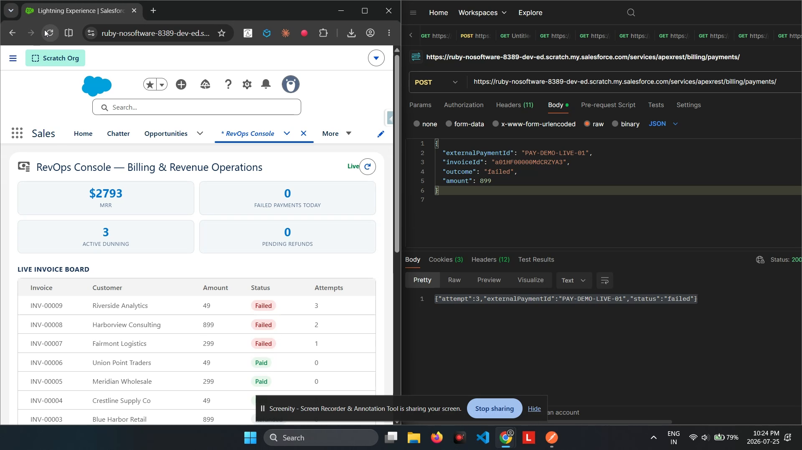

# BillingHub — Subscription Billing & Revenue Operations

The **flagship** of this portfolio: a subscription billing and RevOps platform that combines recurring billing, resilient payment processing, AI-driven churn analysis, a live operations dashboard, and approval-gated refunds — the full "quote-to-cash" back half of a SaaS business, on one Salesforce org.



---

## The client problem

> "We run subscriptions, and billing them is the easy part — the hard part is everything after. Cards get declined and nobody notices until the customer's already frustrated. When someone cancels, their reason just sits in a text field nobody reads twice. Refunds either need a human to check every single one, or they go out with zero oversight. We need the *whole* revenue operation running itself, with a human only stepping in where it actually matters."

## The solution, at a glance

- A **recurring billing engine** (Batch Apex) generates invoices for every subscription due today, and advances the next billing date automatically.
- A **payment webhook intake** (idempotent, like a real Stripe-style integration) marks invoices Paid or Failed as the payment processor reports back — safely ignoring duplicate delivery.
- **Failed payments trigger dunning**: a Queueable retry chain with a real, scheduled delay — and after three failed attempts, the subscription is automatically suspended.
- **AI churn-risk analysis**: when a subscription is canceled, its stated cancellation reason is sent to Gemini, which returns a risk classification, a plain-English analysis, and a recommended win-back action — turning free-text nobody reads into a triaged signal.
- A **live RevOps console** shows MRR, failed payments, active dunning, and pending refunds, updating in real time via Change Data Capture as invoices change.
- **Refunds above a threshold require approval** — an authorization gate on financial exceptions, not a rubber stamp.

## High-level structure (separation of concerns)

```
┌──────────────────────────────────────────────────────────────────────────┐
│  UI            revOpsConsole (LWC) ─► RevOpsController                     │
│                CDC subscription on Invoice__ChangeEvent (live board)       │
├──────────────────────────────────────────────────────────────────────────┤
│  BILLING       SubscriptionBillingBatch   (recurring invoice generation)   │
│  PAYMENTS      PaymentWebhookService      (@RestResource — inbound,        │
│                idempotent payment intake, dunning trigger)                 │
│  DUNNING       DunningRetryQueueable      (delayed retry orchestration)    │
│  AI            ChurnInsightService ─► GeminiCalloutService                │
├──────────────────────────────────────────────────────────────────────────┤
│  DATA          Subscription__c · Invoice__c · Payment_Event_Log__c ·       │
│                Churn_Insight__c · Refund_Request__c                        │
└──────────────────────────────────────────────────────────────────────────┘
```

## The billing → dunning → suspension lifecycle (the distinctive pattern)

```
SubscriptionBillingBatch (daily)
   └► for every Active subscription due today:
        insert Invoice__c (Pending) · advance Next_Billing_Date__c +1 month

Payment processor calls back ─► PaymentWebhookService
   ├─ already-seen External_Payment_Id__c? → log Duplicate, respond 200, stop (idempotent)
   ├─ outcome = succeeded → Invoice → Paid
   └─ outcome = failed:
        ├─ attempt < 3  → Invoice → Failed · DunningRetryQueueable.enqueueRetry(delay)
        └─ attempt = 3  → Invoice → Failed · Subscription → Suspended

DunningRetryQueueable (fires after the delay)
   └► stamps Last_Retry_At__c — a real payment gateway would re-attempt the charge here;
      its async result arrives the same way the first attempt did, via a new webhook call
```

## AI churn-risk analysis

```
Subscription canceled with a stated Cancel_Reason__c
   └► ChurnInsightService builds a prompt from plan, tenure, and the cancellation reason
        └► GeminiCalloutService.generate() — real HTTP callout to Gemini
        └► Response parsed into Risk (Low/Medium/High), Analysis, and a Recommended Action
        └► Stored on Churn_Insight__c, shown inline in the RevOps console
```

---

## Deploy

```powershell
sf org login web --alias billinghub-org
sf project deploy start --source-dir force-app --target-org billinghub-org --test-level RunLocalTests
sf org assign permset --name BillingHub_User --target-org billinghub-org
```

### Required one-time setup

1. Get a free Gemini API key at [aistudio.google.com](https://aistudio.google.com).
2. Setup → **Custom Labels** → **Gemini_Api_Key** → Edit → paste the key → Save (never commit a real key to source).
3. Setup → **Change Data Capture** → move **Invoice__c** to Selected Entities → Save (powers the live board).

## Use it

1. Create a **Subscription** (Active, a Monthly Amount, a Next Billing Date of today).
2. Run `Database.executeBatch(new SubscriptionBillingBatch(), 200);` (or schedule it) — a **Pending** invoice appears.
3. Simulate the payment processor's webhook:
   ```bash
   curl -X POST "<instance-url>/services/apexrest/billing/payments/" \
     -H "Authorization: Bearer <token>" -H "Content-Type: application/json" \
     -d '{"externalPaymentId":"PAY-1","invoiceId":"<invoice-id>","outcome":"succeeded","amount":299}'
   ```
4. Open the **RevOps Console** tab — MRR, dunning, and refund tiles are live; open it in two tabs to watch an invoice change propagate instantly via CDC.
5. Cancel a subscription with a real cancellation reason, then click **Analyze Churn Risk** — a live AI risk assessment appears.
6. Submit a refund above the auto-approve threshold and approve/reject it from the **Pending Refund Approvals** panel.

## Verified live

- **27/27 Apex tests pass**, 94% org-wide coverage.
- Three real bugs were found and fixed via actual test failures and live use during this build: a unique-constraint violation on duplicate-payment logging, an invalid-lookup crash when logging an "invoice not found" error, and a churn-analysis path that silently saved a fabricated "AI unavailable" insight on failure instead of surfacing the real error — all now handled correctly, with tests locking in each fix.
- The **full lifecycle was proven live** with real external HTTP calls: a successful payment, an idempotent duplicate rejection, and three consecutive failed payments that correctly triggered dunning retries and ended in automatic subscription suspension.
- The Gemini churn-analysis callout **retries automatically on a transient 503** (model overloaded) before giving up, and — on genuine failure — throws instead of persisting a placeholder `Churn_Insight__c`, so the console only ever shows a real AI result.

## Testing

```powershell
sf apex run test --target-org billinghub-org --test-level RunLocalTests --result-format human --code-coverage
```

Tests cover the billing batch (invoice generation, due-date filtering), the payment webhook (success, duplicate, dunning, final suspension, not-found, validation), the dunning queueable, the churn AI service (mocked and fallback paths), and the console controller (summary, refunds, churn insights).

## Project layout

```
force-app/main/default/
├── objects/
│   ├── Subscription__c        (Customer, Plan, Monthly Amount, Status, billing dates, Cancel Reason)
│   ├── Invoice__c              (Amount, Status, Attempt Count, Last Retry At)
│   ├── Payment_Event_Log__c    (External_Payment_Id__c — the idempotency key)
│   ├── Churn_Insight__c        (Risk Level, Analysis, Recommended Action)
│   └── Refund_Request__c       (Approval_Status__c — Pending/Approved/Rejected)
├── labels/  Gemini_Api_Key · Gemini_Endpoint_Path
├── remoteSiteSettings/  Gemini_API
├── classes/
│   ├── SubscriptionBillingBatch          (recurring invoice generation)
│   ├── PaymentWebhookService              (@RestResource — inbound payment intake)
│   ├── DunningRetryQueueable               (delayed retry orchestration)
│   ├── GeminiCalloutService · ChurnInsightService   (AI churn-risk analysis)
│   ├── RevOpsController                    (console UI layer, refund approval)
│   └── *Test
├── lwc/  revOpsConsole
├── tabs/  RevOps_Console
└── permissionsets/  BillingHub_User
```

## Notes & caveats

- **Refund approval is a permission-gated Apex service, not a native Salesforce Approval Process.** Native Approval Processes are notoriously fragile to deploy via source-format metadata (many required nested elements, approver-assignment quirks). Given this project already demonstrates Batch Apex, Queueable orchestration, a custom REST API, AI integration, and CDC, the pragmatic call was a reliable, equally real "authorization gate above a threshold" pattern in code. In production, this would be a natural candidate for a declarative Approval Process.
- The dunning retry doesn't itself decide success or failure — a real payment gateway integration would make its own outbound charge attempt here, with the result arriving asynchronously via the same webhook path as the first attempt. That's realistic: retries are "try again and wait," not a synchronous decision.
- The Gemini API key is a Custom Label (see CaseCopilot's README for why, versus Custom Metadata Type or Named Credential).
