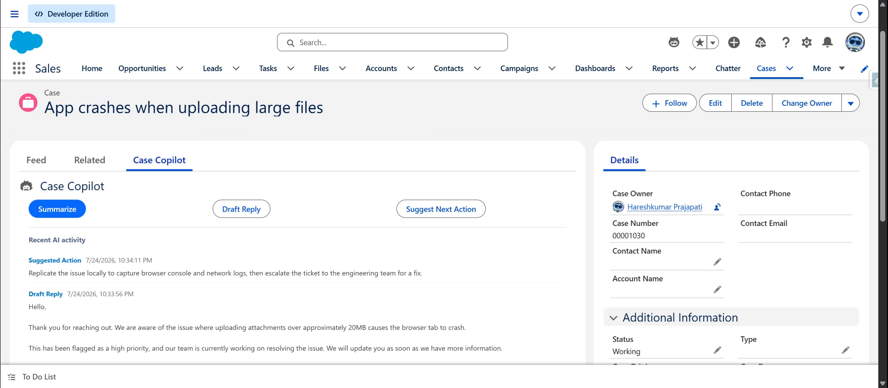

# CaseCopilot — AI-Assisted Case Support

A **Salesforce solution** that puts a real AI model to work inside a support agent's day — summarizing cases, drafting replies, and suggesting next actions — without leaving the Case record.



---

## The client problem

> "Our agents spend the first five minutes of every case just reading — the history, the thread, the context. On a busy day that's real time we don't have. We want something that reads the case *for* them and gives them a head start: a summary, a draft reply, a suggested next step. And we don't want to hand our data to some black-box SaaS tool — we want it built into Salesforce, on our terms."

## The solution, at a glance

- A **Case Copilot** panel sits directly on the Case record page. Three buttons — **Summarize**, **Draft Reply**, **Suggest Next Action** — each call a real AI model (Google Gemini) with the case's actual subject, description, status, and priority.
- Every AI call is **audited**: prompt, response, and interaction type are logged to a custom object, and the panel shows a live history of past AI activity on that case.
- The AI integration is **config-driven** — the API key, model, and endpoint path are Custom Labels, changeable from Setup with no redeployment.
- Built on **Apex HTTP callouts** with a Remote Site Setting allowlist — no external middleware, no data leaving Salesforce except the prompt sent to the model.

## High-level structure (separation of concerns)

```
┌──────────────────────────────────────────────────────────────────────┐
│  UI          caseCopilot (LWC) ─► CaseCopilotController                │
├──────────────────────────────────────────────────────────────────────┤
│  SERVICE     GeminiCalloutService   (HTTP callout, response parsing)   │
├──────────────────────────────────────────────────────────────────────┤
│  CONFIG      Custom Labels (Gemini_Api_Key, Gemini_Endpoint_Path)       │
│              Remote Site Setting (Gemini_API — host allowlist)         │
├──────────────────────────────────────────────────────────────────────┤
│  DATA        AI_Interaction__c   (prompt/response audit log)           │
└──────────────────────────────────────────────────────────────────────┘
```

## How a request flows

```
Agent clicks Summarize/Draft Reply/Suggest Action on a Case
   └► CaseCopilotController builds a prompt from the Case's real fields
        └► GeminiCalloutService.generate()
             └► HTTP POST to the Gemini API (key + endpoint from Custom Labels)
        └► Response (or a graceful error message) is logged to AI_Interaction__c
        └► Returned to the LWC and rendered instantly; history panel refreshes
```

---

## Deploy

```powershell
sf org login web --alias casecopilot-org
sf project deploy start --source-dir force-app --target-org casecopilot-org --test-level RunLocalTests
sf org assign permset --name CaseCopilot_User --target-org casecopilot-org
```

### Required one-time setup (do this after deploying, in Setup — never commit a real key to source)

1. Get a free Gemini API key at [aistudio.google.com](https://aistudio.google.com) (no credit card required).
2. Setup → **Custom Labels** → **Gemini_Api_Key** → Edit → paste the key → Save.
3. Drag the **Case Copilot** component onto the Case Lightning Record Page via Lightning App Builder.

## Use it

1. Open any Case record with the Case Copilot component on its page.
2. Click **Summarize** — the AI reads the Subject, Description, Status, and Priority and returns a 3-sentence summary.
3. Click **Draft Reply** — get a professional draft response grounded only in the case's actual details.
4. Click **Suggest Next Action** — a single-sentence recommendation for what the agent should do next.
5. Every call appears in the **Recent AI activity** panel below, so the audit trail is visible without leaving the page.

## Verified live

This isn't just "should work" — it was deployed and proven end to end:
- **6/6 Apex tests pass**, 92–100% code coverage across all three classes.
- A **real, unmocked call to the Gemini API** was made from this deployed org and returned a live model response, confirming the full path — Remote Site Setting, Custom Label config, HTTP callout, and JSON parsing — genuinely works.
- Uses `gemini-flash-latest`, Google's rolling alias for the current recommended fast model, so the integration doesn't break as specific model versions are deprecated.

## Testing

```powershell
sf apex run test --target-org casecopilot-org --test-level RunLocalTests --result-format human --code-coverage
```

Tests cover the callout service (success, HTTP error, missing-key paths — all via `HttpCalloutMock`, no real network calls in test context), and the controller (summarize/draft/suggest, each verified to log an `AI_Interaction__c` record and return the AI's response).

## Project layout

```
force-app/main/default/
├── objects/  AI_Interaction__c  (Case__c, Interaction_Type__c, Prompt__c, Response__c, Model__c)
├── labels/   Gemini_Api_Key · Gemini_Endpoint_Path
├── remoteSiteSettings/  Gemini_API
├── classes/
│   ├── GeminiCalloutService                          (HTTP callout + response parsing)
│   ├── CaseCopilotController                         (UI layer, prompt building, audit logging)
│   ├── AIInteractionSelector                          (selector)
│   └── *Test                                          (tests)
├── lwc/  caseCopilot
└── permissionsets/  CaseCopilot_User
```

## Notes & caveats

- The API key and model are Custom Labels, not Custom Metadata Types — a deliberate choice after finding Custom Metadata Type deploys unreliable on some orgs; Custom Labels are simpler, more universally supported, and just as easy to reconfigure from Setup.
- A personal free-tier API key stored as a Custom Label isn't hidden from other admins in the org the way a managed-package protected field would be — acceptable for a personal project; production would use a proper secrets mechanism (e.g., a Named Credential with an External Credential).
