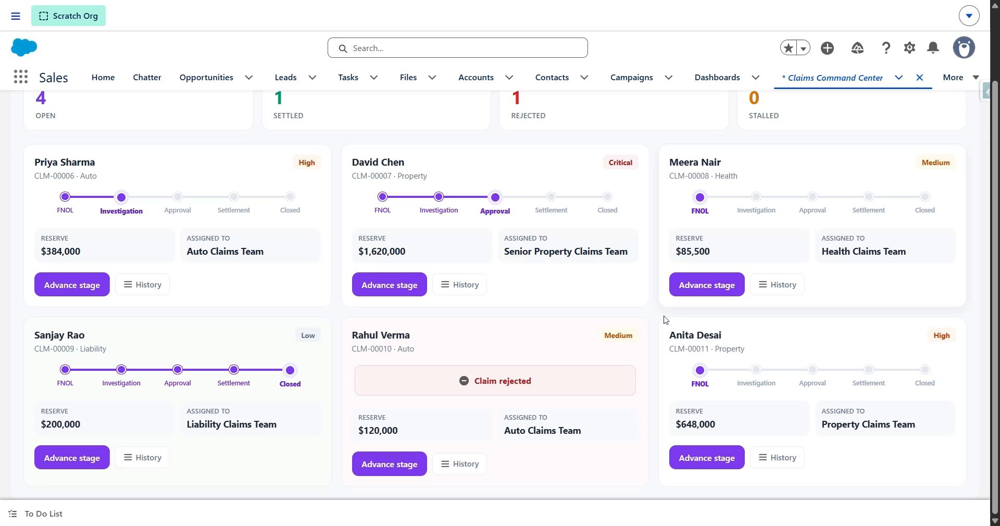

# ClaimFlow — Insurance Claims Lifecycle Engine

A **Salesforce solution** to an insurer's claims-handling problem, built with an enterprise **layered architecture** and a config-driven **finite state machine**.



▶️ **[Watch the demo](https://youtu.be/VU38bwMwzX4)**

---

## The client problem

> "Our claims are supposed to go FNOL → Investigation → Approval → Settlement, but in practice adjusters skip steps, claims get stuck in a stage for weeks with nobody noticing, reserves are set by gut feel, and every adjuster routes work differently. We need the **process enforced by the system**, reserves and routing **calculated consistently**, stalled claims **surfaced automatically**, and a full **audit trail** of every stage change — and we need to change the lifecycle rules without a developer."

## The solution, at a glance

- Stage changes are **validated against a state machine** — a claim can only move along configured transitions, so steps can't be skipped or reversed.
- **Reserves** and **team assignment** are computed automatically from claim type + severity.
- A scheduled **aging sweep** flags claims that sit too long in one stage.
- Every transition writes an immutable **Claim History** record.
- The allowed transitions, reserve factors and routing all live in **Custom Metadata** — the client reshapes the lifecycle in Setup.

## High-level structure (separation of concerns)

```
┌──────────────────────────────────────────────────────────────────────┐
│  UI          claimConsole (LWC) ─► ClaimConsoleController              │
├──────────────────────────────────────────────────────────────────────┤
│  DOMAIN      ClaimTrigger ─► ClaimTriggerHandler ─► TriggerHandler(base)│
├──────────────────────────────────────────────────────────────────────┤
│  SERVICE     ClaimLifecycleService  ← the STATE MACHINE (transition guard) │
│              ReserveService   (amount × type factor × severity)        │
│              AssignmentService(route by type; escalate Critical)       │
├──────────────────────────────────────────────────────────────────────┤
│  SELECTOR    ClaimSelector                                            │
├──────────────────────────────────────────────────────────────────────┤
│  ASYNC       StageAgingBatch + StageAgingScheduler                    │
│  UOW/LOG     UnitOfWork · Logger + Log__c                             │
├──────────────────────────────────────────────────────────────────────┤
│  CONFIG      Stage_Transition__mdt (the FSM) · Claim_Type_Config__mdt  │
│  DATA        Claim__c · Claim_History__c                              │
└──────────────────────────────────────────────────────────────────────┘
```

## The state machine (the distinctive pattern)

The allowed transitions are **data**, not code — each `Stage_Transition__mdt` row is one edge of the graph:

```
FNOL ──► Investigation ──► Approval ──► Settlement ──► Closed
                │              │
                └──► Rejected  └──► Rejected
```

`ClaimLifecycleService.validateTransitions` checks every stage change against this set and `addError`s anything not on the graph — so **FNOL → Settlement is rejected**, a closed claim can't reopen, etc. To change the lifecycle (add a "Litigation" stage, allow a shortcut), the client adds/edits Custom Metadata rows — no deployment.

## How a claim flows

```
New claim ─► ClaimTrigger ─► Handler
   beforeInsert:  default Stage = FNOL · AssignmentService · ReserveService · stamp stage time
   beforeUpdate:  ClaimLifecycleService.validateTransitions  (FSM guard — blocks illegal)
                  ReserveService (recompute) · stamp stage time on change
   afterInsert/Update:  UnitOfWork commits Claim_History__c  (successful transitions only)

Nightly ─► StageAgingScheduler ─► StageAgingBatch
   └► ClaimSelector.locatorOpen ─► flag claims stuck > threshold ─► Logger summary
```

The guard runs in **before**-update (so illegal saves are rejected with a clear message); the audit is written in **after**-update (Ids exist, and only successful transitions reach it).

---

## Deploy

```powershell
sf org login web --alias claim-org
sf project deploy start --source-dir force-app --target-org claim-org --test-level RunLocalTests
sf org assign permset --name Claims_Adjuster --target-org claim-org
```

Schedule the aging sweep once, from anonymous Apex:

```apex
System.schedule('Claim Aging Nightly', '0 0 3 * * ?', new StageAgingScheduler());
```

## Use it

1. App Launcher → **Claims Command Center** (custom tab), or drop the component on any Lightning page.
2. **Seed demo claims** — a mix of types/severities, a couple already advanced along the legal path, one back-dated so it reads as stalled.
3. Note the auto-assigned team, computed reserve, and colour-coded stage on each row.
4. **Advance** a claim: try a legal step (e.g. FNOL → Investigation) — it works; try skipping (FNOL → Settlement) — **the state machine blocks it** with a clear message.
5. **History** on a row shows the full transition trail.
6. **Run aging sweep** → the back-dated claim is flagged **Stalled**.
7. **Reshape the lifecycle:** Setup → Custom Metadata Types → **Stage Transition** → add or deactivate an edge → new transitions honour it immediately.

## Testing

```powershell
sf apex run test --target-org claim-org --test-level RunLocalTests --result-format human --code-coverage
```

Tests cover the FSM (allowed/blocked), reserve math, assignment routing, the trigger integration (insert + legal + illegal transitions + audit), the aging batch + scheduler, and the controller. `ClaimTestData` injects the FSM and type config via `@TestVisible` seams.

## Project layout

```
force-app/main/default/
├── customMetadata/  Stage_Transition.* (6 edges) · Claim_Type_Config.* (4)
├── objects/  Stage_Transition__mdt · Claim_Type_Config__mdt · Claim__c · Claim_History__c · Log__c
├── triggers/  ClaimTrigger
├── classes/
│   ├── TriggerHandler · UnitOfWork · Logger                (framework)
│   ├── StageTransitionService · ClaimConfigService         (config accessors)
│   ├── ClaimLifecycleService · ReserveService · AssignmentService (service)
│   ├── ClaimSelector · ClaimTriggerHandler                 (selector · domain)
│   ├── StageAgingBatch · StageAgingScheduler               (async)
│   ├── ClaimConsoleController                              (UI)
│   └── *Test + ClaimTestData                               (tests)
├── lwc/  claimConsole
├── tabs/  Claims_Command_Center
└── permissionsets/  Claims_Adjuster
```

## Notes & caveats

- Metadata-only project — deploy to a Salesforce org (a free [Developer Edition](https://developer.salesforce.com/signup) works). Not runnable locally.
- The stall threshold is a constant in `StageAgingBatch` (documented); it could equally be Custom Metadata like the rest of the config.
- Validated all metadata is well-formed and the Apex is structurally sound, but this hasn't been deployed to a live org — `sf project deploy start --test-level RunLocalTests` is the final confirmation.
