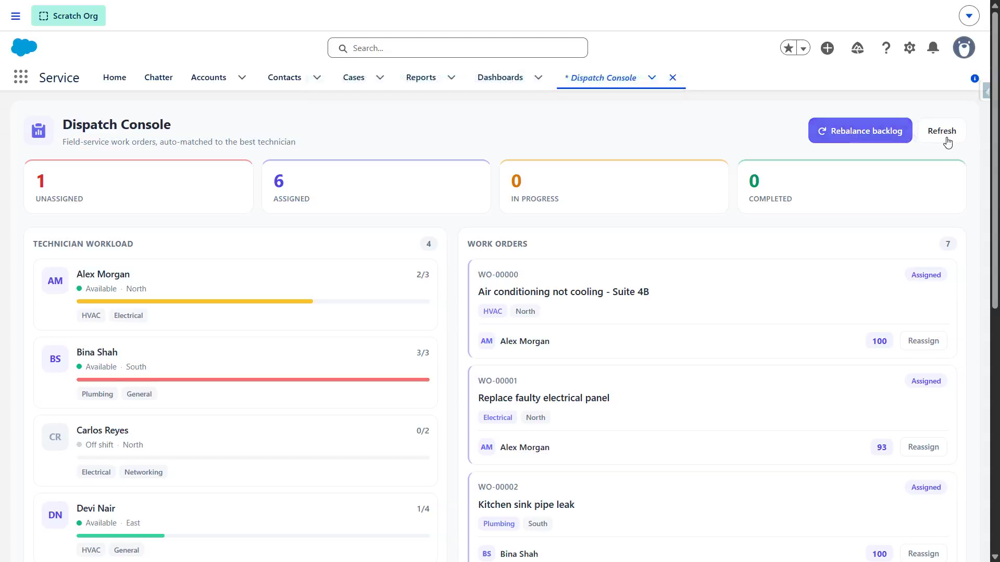

# DispatchFlow — Field Service Dispatch Engine

A **Salesforce solution** to a field-service firm's assignment problem, built with an enterprise **layered architecture** and a scoring-based **matching/optimization engine**.



▶️ **[Watch the demo](https://youtu.be/_jfx6uZi_zU)**

---

## The client problem

> "Our dispatchers assign jobs by gut feel. A plumber gets sent to an electrical fault, someone drives across three territories while a local tech sits idle, and our best people are buried while others are empty. We need the system to **pick the right technician for every job** — the right skill, the right area, and someone who isn't already overloaded — and to **spread the work fairly**. And we want to tune what 'right' means without a developer."

## The solution, at a glance

- Every work order is **auto-dispatched** to the best-matching technician the moment it's created — scored on **skill match × territory × current load**.
- Work is **balanced**: within a batch of new orders, each assignment updates the running load so jobs spread across the team instead of piling on one person.
- Technician **load is a live roll-up**, so capacity is always accurate.
- Jobs with no eligible technician wait in a backlog that a **scheduled rebalance** works as capacity frees up.
- Every assignment writes an **audit** (who, score, how many candidates, why).
- The scoring **weights** live in **Custom Metadata** — tuned in Setup.

## High-level structure (separation of concerns)

```
┌──────────────────────────────────────────────────────────────────────┐
│  UI          dispatchConsole (LWC) ─► DispatchConsoleController        │
├──────────────────────────────────────────────────────────────────────┤
│  DOMAIN      WorkOrderTrigger ─► Handler ─► TriggerHandler (base)      │
├──────────────────────────────────────────────────────────────────────┤
│  SERVICE     MatchingService   ← the MATCHING engine (score+rank pool) │
│              DispatchService   (assign best, balance load in-batch)    │
│              TechnicianLoadService (live load roll-up)                 │
│              AssignmentLogService (audit trail)                        │
├──────────────────────────────────────────────────────────────────────┤
│  SELECTOR    TechnicianSelector · WorkOrderSelector                   │
├──────────────────────────────────────────────────────────────────────┤
│  ASYNC       RebalanceBatch + RebalanceScheduler                      │
│  UOW/LOG     UnitOfWork · Logger + Log__c                             │
├──────────────────────────────────────────────────────────────────────┤
│  CONFIG      Match_Weight__mdt (skill · territory · load weights)      │
│  DATA        Technician__c · Work_Order__c · Assignment_Log__c         │
└──────────────────────────────────────────────────────────────────────┘
```

## The matching engine (the distinctive pattern)

Unlike a decisioning engine that scores one record, this **scores a whole pool and selects the best**. For a work order, `MatchingService` filters to *eligible* technicians (available, has the required skill, not at capacity) and scores each:

```
score = Skill_Weight                         (eligible ⇒ skill matched)
      + Territory_Weight × (same territory)
      + Load_Weight     × capacity-headroom   (more free capacity = higher)
      ── 0 to 100, ties broken toward the lighter-loaded technician
```

`DispatchService` then walks the unassigned orders, and — crucially — **increments an in-memory load map as it assigns**, so a bulk of new orders is spread across the team rather than all landing on the single highest scorer. After the DML, `TechnicianLoadService` reconciles each technician's `Active_Jobs__c` to the true count.

Because the weights are Custom Metadata, the client can decide skill matters more than proximity (or vice-versa) in Setup — no deployment.

## How a work order flows

```
New work order (Unassigned) ─► WorkOrderTrigger ─► Handler
   beforeInsert:  DispatchService.autoDispatch
                    └► MatchingService.rank(pool)  (reads Match_Weight__mdt)
                    └► assign best technician in place, balance load across the batch
   afterInsert:   AssignmentLogService audit (UoW)  ·  TechnicianLoadService roll-up

Backlog (no eligible tech) ─► RebalanceScheduler ─► RebalanceBatch
   └► WorkOrderSelector.locatorUnassigned ─► same dispatch + audit + roll-up
```

---

## Deploy

```powershell
sf org login web --alias dispatch-org
sf project deploy start --source-dir force-app --target-org dispatch-org --test-level RunLocalTests
sf org assign permset --name Dispatcher --target-org dispatch-org
```

Schedule the rebalance once, from anonymous Apex:

```apex
System.schedule('Dispatch Rebalance', '0 0/30 * * * ?', new RebalanceScheduler());
```

## Use it

1. App Launcher → **Dispatch Console** (custom tab), or drop the component on any Lightning page.
2. Create technicians (skills, territory, capacity) and work orders — or load your own records. Inserting a work order **auto-dispatches** it to the best-matching technician; watch the *Technician workload* table fill and the tiles move.
3. A work order whose required skill has no *available* technician stays **Unassigned** — that's the backlog. (Territory is a *preference*, not a hard rule, so a job in an uncovered territory is picked up by a skilled technician who travels.)
4. Make a technician available (edit the record → *Is Available*), then **Rebalance backlog** — the waiting work order is assigned.
5. **Reassign** on a row moves a job manually; both technicians' loads re-roll-up.
6. **Tune the weights:** Setup → Custom Metadata Types → **Match Weight** → *Default* → raise *Territory Weight* → new dispatches favour locality.

## Testing

```powershell
sf apex run test --target-org dispatch-org --test-level RunLocalTests --result-format human --code-coverage
```

Tests cover the matching engine (skill/territory/capacity/tie-break, pure), the trigger integration (auto-assign, no-eligible, capacity cap, **even load balancing across technicians**, completing frees load), the rebalance batch + scheduler, and the controller (seed, summary, manual reassign). `DispatchTestData` injects weights via a `@TestVisible` seam.

## Project layout

```
force-app/main/default/
├── customMetadata/  Match_Weight.Default
├── objects/  Match_Weight__mdt · Technician__c · Work_Order__c · Assignment_Log__c · Log__c
├── triggers/  WorkOrderTrigger
├── classes/
│   ├── TriggerHandler · UnitOfWork · Logger              (framework)
│   ├── MatchWeightService                                (config accessor)
│   ├── MatchingService · DispatchService ·
│   │   TechnicianLoadService · AssignmentLogService      (service)
│   ├── TechnicianSelector · WorkOrderSelector ·
│   │   WorkOrderTriggerHandler                           (selector · domain)
│   ├── RebalanceBatch · RebalanceScheduler               (async)
│   ├── DispatchConsoleController                         (UI)
│   └── *Test + DispatchTestData                          (tests)
├── lwc/  dispatchConsole
├── tabs/  Dispatch_Console
└── permissionsets/  Dispatcher
```

## Notes & caveats

- Metadata-only project — deploy to a Salesforce org (a free [Developer Edition](https://developer.salesforce.com/signup) works). Not runnable locally.
- The candidate pool is all available technicians; at very large scale you'd pre-filter by skill/territory in the query. The layered design isolates that to the selector.
- Validated all metadata is well-formed and the Apex is structurally sound, but this hasn't been deployed to a live org — `sf project deploy start --test-level RunLocalTests` is the final confirmation.
