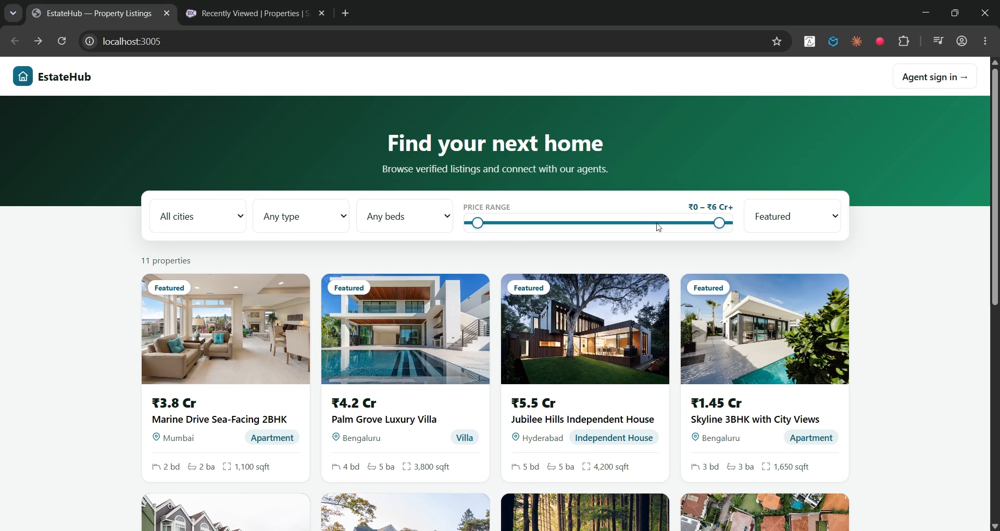

# EstateHub — Real Estate Listings Portal

A full-stack property marketplace built with **React** and **Salesforce**, connected through a **Node.js REST API** layer.

Buyers browse and search listings with live filters, view property details, and send inquiries — no account required — while agents sign in to manage the catalog and follow up on leads. Listings are a custom **`Property__c`** object; every inquiry becomes a standard Salesforce **Lead**, tying the custom data back into Sales Cloud.



▶️ **[Watch the demo](https://youtu.be/O6DX50CsFI8)** · Agents sign in via **OAuth 2.0 (PKCE)**.

---

## What sets this project apart: dynamic search

The signature feature is **server-side filtered search**. Filter values from the query string (city, type, price range, bedrooms, sort) are turned into a SOQL `WHERE` clause — safely:

- **Text** is escaped before interpolation (`City__c LIKE '%…%'`).
- **Numbers** are parsed and range-checked before use.
- **Picklist values** are checked against an allow-list.
- **Record IDs** are format-validated.

So no user input is ever trusted in the query. Changing any filter re-queries Salesforce and re-renders the grid.

```
Property__c (custom object)              Inquiry → standard Lead
├── Name          (Property Title)       ├── LastName / Company
├── City__c                              ├── Email / Phone
├── Price__c      (Currency)             ├── LeadSource = 'Web'
├── Bedrooms__c / Bathrooms__c           └── Property_Interest__c  ← links to the listing
├── Area_SqFt__c
├── Property_Type__c  (picklist)
├── Listing_Status__c (Available/Under Offer/Sold)
├── Image_URL__c / Featured__c
└── Description__c
```

## Architecture

```
┌──────────────────┐        ┌───────────────────────┐        ┌──────────────────┐
│     FRONTEND     │        │       API LAYER       │        │     BACKEND      │
│    React SPA     │  HTTPS │    Node / Express     │  REST  │    Salesforce    │
│                  │ ─────► │                       │ ─────► │                  │
│  Listings +      │  JSON  │  /api/public/* ────── │ ─────► │  integration     │
│  filters + detail│        │  (integration user)   │        │  user session    │
│  (no login)      │ ◄───── │  dynamic SOQL search  │ ◄───── │                  │
│                  │        │                       │        │                  │
│  Agent console   │        │  /api/admin/*  ────── │ ─────► │  per-agent       │
│      :3005       │        │  (session per agent)  │        │  session         │
│                  │        │        :5005          │        │  Property__c/Lead│
└──────────────────┘        └───────────────────────┘        └──────────────────┘
```

Two access tiers: the **public** listings site runs under an integration user; the **agent console** uses per-user authenticated sessions.

## Tech Stack

| Tier | Technology |
|---|---|
| Frontend | React 18, Vite |
| API layer | Node.js, Express, jsforce, dynamic SOQL builder |
| Backend | Salesforce custom object (`Property__c`) + a custom `Lead` field, permission set |
| Auth | Service connection for public routes + **OAuth 2.0 (PKCE)** sessions for the agent console |

## Repository Structure

| Path | Description |
|---|---|
| [client/](client/) | React SPA — listings, filter bar, property detail, inquiry form, agent console |
| [server/](server/) | Express REST API — filtered search, inquiry→Lead, property CRUD, inquiries inbox |
| [salesforce/](salesforce/) | `Property__c` + `Lead.Property_Interest__c` metadata, permission set, setup guide |

---

## Getting Started

### 1. Deploy the Salesforce customizations (one-time)

Follow [salesforce/README.md](salesforce/README.md). With the Salesforce CLI:

```powershell
cd salesforce
sf project deploy start --source-dir force-app --target-org <your-org>
sf org assign permset --name EstateHub_Admin --target-org <your-org>
```

### 2. Run the API server

```powershell
cd server
copy .env.example .env    # then fill in SF_ORG + SF_CLIENT_ID (Connected App consumer key)
npm install
npm run dev
```

The API starts on `http://localhost:5005`.

### 3. Run the frontend

```powershell
cd client
npm install
npm run dev
```

The app is served at `http://localhost:3005`.

### 4. Try it

1. Sign in as an agent and add a few listings (set city, price, beds, type; optionally an image URL and "Featured").
2. Back on the public site, use the filter bar — city, type, price range, bedrooms, sort — and watch results update.
3. Open a listing and send an inquiry.
4. As the agent, open the **Inquiries** tab to see it; in Salesforce, **App Launcher → Leads** shows the lead with its `Property Interest`.

---

## API Reference

### Public (no authentication)

| Method | Endpoint | Description |
|---|---|---|
| `GET` | `/api/public/properties` | Search listings — query: `city, type, minPrice, maxPrice, bedrooms, sort` |
| `GET` | `/api/public/properties/cities` | Distinct cities for the filter dropdown |
| `GET` | `/api/public/properties/:id` | A single listing |
| `POST` | `/api/public/properties/:id/inquire` | Send an inquiry (creates a Lead) |

### Admin (`Authorization: Bearer <sessionId>`)

| Method | Endpoint | Description |
|---|---|---|
| `GET` · `POST` | `/api/auth/login` · `/logout` | Agent OAuth 2.0 (PKCE) login & logout |
| `GET` | `/api/admin/properties` | Full catalog (incl. sold) |
| `POST` / `PATCH` / `DELETE` | `/api/admin/properties[/:id]` | Manage listings |
| `GET` | `/api/admin/inquiries` | Web leads raised from listings |

### Integration notes

- **Search is server-side** — filtering and sorting happen in Salesforce via SOQL, not in the browser, so it scales to large catalogs.
- **Inquiry → Lead** maps custom listing data into standard Sales Cloud; `Property_Interest__c` records which listing drove the lead.
- **SOQL injection** is guarded by escaping, numeric validation, allow-listed picklists, and record-ID checks.

## Security Notes

- Salesforce tokens (both tiers) exist only server-side; browsers hold at most an opaque session ID.
- The integration user should be a **least-privilege account** in production.
- Sessions are in-memory; use a shared store (e.g. Redis) and HTTPS end-to-end for production.

## Roadmap

- Map view with geocoded pins
- Saved searches and email alerts on new matches
- Multiple photos per listing (Salesforce Files / ContentVersion)
- Agent assignment and lead routing rules
