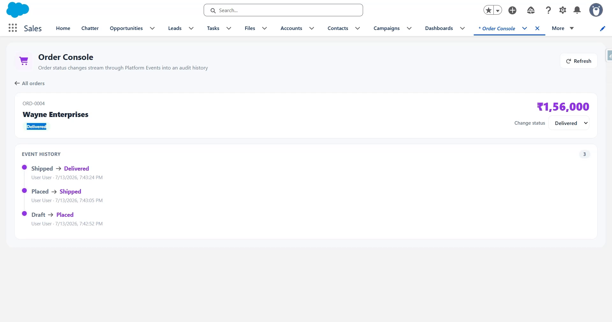

# Event Relay — Salesforce Platform Events

A **100% Salesforce** order-tracking app built on **Platform Events**. When an order's status changes, Apex *publishes* an event; a decoupled *subscriber* trigger reacts by writing an audit-history record. This is the event-driven publish/subscribe pattern that underpins modern enterprise Salesforce architectures.



▶️ **[Watch the demo](https://youtu.be/Y6U0b2wRAlk)**

---

## The pattern

```
  ┌────────────┐   status change   ┌──────────────────────┐
  │  Order__c  │ ────────────────► │  OrderTrigger        │  (publisher)
  │  (record)  │                    │  after update        │
  └────────────┘                    └──────────┬───────────┘
                                                │ EventBus.publish
                                                ▼
                              ┌───────────────────────────────┐
                              │  Order_Status_Event__e         │   (the event bus)
                              └──────────────┬────────────────┘
                                             │ delivered async
                                             ▼
                              ┌───────────────────────────────┐
                              │  OrderStatusEventTrigger       │  (subscriber)
                              │  after insert                  │
                              └──────────────┬────────────────┘
                                             │ insert
                                             ▼
                              ┌───────────────────────────────┐
                              │  Order_History__c  (audit log) │
                              └───────────────────────────────┘
```

**Why it matters:** the order transaction publishes an event and knows nothing about who consumes it. New consumers — an email notifier, an external system via CometD, a second audit process — can subscribe later **without touching the order code**. That decoupling is the whole reason platform events exist.

## What it demonstrates

| Capability | Where |
|---|---|
| **Platform Event** (`__e`) | `Order_Status_Event__e` (HighVolume, publish-after-commit) |
| **Event publisher** | `OrderTrigger` → `OrderEventPublisher` (`EventBus.publish`) |
| **Event subscriber** | `OrderStatusEventTrigger` (after-insert on the event) → `OrderEventSubscriber` |
| **Testing async events** | `OrderEventTest` uses `Test.getEventBus().deliver()` |
| **Custom objects + validation** | `Order__c`, `Order_History__c`; amount cannot be negative |
| **Apex controller + LWC** | `OrderController`, `orderConsole` |
| **Permission set + custom tab** | `Event Relay User`, `Order Console` |

## Data model

```
Order__c                          Order_Status_Event__e (platform event)   Order_History__c
├── Name         ORD-{0000}       ├── Order_Id__c                          ├── Name        HIST-{0000}
├── Customer_Name__c              ├── Order_Number__c                      ├── Order__c    Lookup
├── Amount__c    Currency         ├── Old_Status__c                        ├── Old_Status__c
└── Status__c    Draft→…→         ├── New_Status__c                        ├── New_Status__c
                 Cancelled        └── Changed_By__c                        ├── Changed_By__c
                                                                           └── Event_Time__c
```

---

## Deploy

Requires the [Salesforce CLI](https://developer.salesforce.com/tools/salesforcecli) (`sf`).

```powershell
# 1. Authenticate with your org
sf org login web --alias relay-org

# 2. Deploy everything and run the tests
sf project deploy start --source-dir force-app --target-org relay-org --test-level RunLocalTests

# 3. Grant yourself access
sf org assign permset --name Event_Relay_User --target-org relay-org
```

Everything (event, triggers, Apex) deploys active — no manual activation needed.

---

## Use it

1. App Launcher → **Order Console** (custom tab) — or drop the *Order Console* component on any Lightning App/Home page.
2. Click **Seed sample data** to create a few orders.
3. Open an order and change its **Status**. Behind the scenes: the order updates → `OrderTrigger` publishes an `Order_Status_Event__e` → the event is delivered → `OrderStatusEventTrigger` writes an `Order_History__c` record.
4. Because delivery is **asynchronous**, click **Refresh** after a moment — the new entry appears in the status-history timeline, showing the old → new transition and who made it.

You can watch the raw events too: **Setup → Platform Events → Order Status Event** shows the definition, and the subscriber writes to **App Launcher → Order History**.

---

## Testing

```powershell
sf apex run test --target-org relay-org --test-level RunLocalTests --result-format human --code-coverage
```

`OrderEventTest` is the interesting one: platform events deliver asynchronously, so each test publishes by updating an order, then calls **`Test.getEventBus().deliver()`** to force the subscriber to run synchronously, and finally asserts on the `Order_History__c` it wrote. It covers a status change, a non-status change (no event), multiple transitions, and the bulk case.

## Project layout

```
force-app/main/default/
├── objects/
│   ├── Order__c/                 (object + 3 fields + validation rule)
│   ├── Order_History__c/         (object + 5 fields)
│   └── Order_Status_Event__e/    (platform event + 5 fields)
├── triggers/
│   ├── OrderTrigger              (publisher)
│   └── OrderStatusEventTrigger   (subscriber)
├── classes/   OrderEventPublisher · OrderEventSubscriber · OrderController (+ tests)
├── lwc/       orderConsole       (html · js · css · meta)
├── tabs/      Order_Console
└── permissionsets/  Event_Relay_User
```

## Notes

- Metadata-only project — deploy it to a Salesforce org (a free [Developer Edition](https://developer.salesforce.com/signup) works). It can't be "run" locally like a Node app.
- The history record is created by the **Automated Process** user (that's who runs platform-event triggers), which is normal and worth knowing when you look at record ownership.
