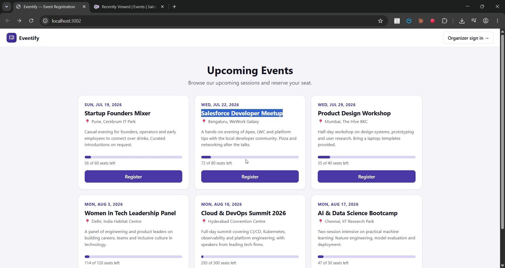

# Eventify — Event Registration Platform

A full-stack event registration platform built with **React** and **Salesforce**, connected through a **Node.js REST API** layer.

Visitors browse upcoming events and reserve seats on a public page — no account required — while organizers sign in to an admin console to manage events, track capacity, and check attendees in. All data lives in Salesforce as **custom objects** with a master-detail relationship.



▶️ **[Watch the demo](https://youtu.be/5acgQzWXq8A)**

---

## Data Model (custom objects)

```
Event__c  (parent)                     Registration__c  (child)
├── Name            Text               ├── Name              Auto Number (REG-{0000})
├── Event_Date__c   Date               ├── Event__c          Master-Detail → Event__c
├── Location__c     Text(255)          ├── Attendee_Name__c  Text(255), required
├── Capacity__c     Number             ├── Email__c          Email, required
└── Description__c  Long Text          └── Checked_In__c     Checkbox
```

The master-detail relationship means registrations belong to their event: deleting an event cascade-deletes its registrations, and sharing is controlled by the parent. The full metadata is included as source in [salesforce/force-app/](salesforce/force-app/) and deploys with one CLI command.

## Architecture

```
┌──────────────────┐        ┌───────────────────────┐        ┌──────────────────┐
│     FRONTEND     │        │       API LAYER       │        │     BACKEND      │
│    React SPA     │  HTTPS │    Node / Express     │  REST  │    Salesforce    │
│                  │ ─────► │                       │ ─────► │                  │
│  Public events   │  JSON  │  /api/public/* ────── │ ─────► │  integration     │
│  page (no login) │        │  (integration user)   │        │  user session    │
│                  │ ◄───── │                       │ ◄───── │                  │
│  Admin console   │        │  /api/admin/*  ────── │ ─────► │  per-admin       │
│  (authenticated) │        │  (session per admin)  │        │  session         │
│      :3002       │        │        :5002          │        │  Event__c        │
│                  │        │                       │        │  Registration__c │
└──────────────────┘        └───────────────────────┘        └──────────────────┘
```

Two access tiers, one API:

- **Public tier** (`/api/public/*`) — event listings and seat reservations run under a dedicated **integration user** configured on the server. Visitors never authenticate; business rules (capacity limits, duplicate-email checks) are enforced server-side so they hold regardless of what the client sends.
- **Admin tier** (`/api/admin/*`) — organizers authenticate with their own Salesforce credentials; each session maps to its own Salesforce connection, so record ownership and audit fields reflect the actual user.

## Tech Stack

| Tier | Technology |
|---|---|
| Frontend | React 18, Vite |
| API layer | Node.js, Express, jsforce |
| Backend | Salesforce custom objects (`Event__c`, `Registration__c`), master-detail, permission set |
| Auth | Integration-user connection (public) + credential-based sessions (admin) |

## Repository Structure

| Path | Description |
|---|---|
| [client/](client/) | React SPA — public events page, registration flow, organizer console |
| [server/](server/) | Express REST API — public + admin tiers, capacity/duplicate validation |
| [salesforce/](salesforce/) | Deployable custom-object metadata, permission set, setup guide |

---

## Getting Started

### 1. Deploy the Salesforce data model (one-time)

The custom objects must exist in the org before the app can run — follow [salesforce/README.md](salesforce/README.md). With the Salesforce CLI it's two commands:

```powershell
cd salesforce
sf project deploy start --source-dir force-app --target-org <your-org>
sf org assign permset --name Eventify_Admin --target-org <your-org>
```

(Manual point-and-click steps are also documented for orgs without CLI access.)

### 2. Run the API server

```powershell
cd server
copy .env.example .env    # then fill in SF_USERNAME / SF_PASSWORD / SF_TOKEN
npm install
npm run dev
```

The API starts on `http://localhost:5002`. The `.env` credentials are the **integration user** that powers the public page — in a Developer org, your own credentials work.

### 3. Run the frontend

```powershell
cd client
npm install
npm run dev
```

The app is served at `http://localhost:3002`.

### 4. Try both audiences

- **As an organizer:** click *Organizer sign in*, authenticate, and create an event with a capacity.
- **As a visitor:** back on the public page, register for the event — watch the seat meter fill, try registering the same email twice (rejected), and fill the event to capacity (sold out).
- **In Salesforce:** App Launcher → **Events** shows the records, each with its related list of registrations.

---

## API Reference

### Public (no authentication)

| Method | Endpoint | Description |
|---|---|---|
| `GET` | `/api/public/events` | Upcoming events with seat availability |
| `POST` | `/api/public/events/:id/register` | Reserve a seat (validates capacity + duplicate email) |

### Admin (`Authorization: Bearer <sessionId>`)

| Method | Endpoint | Description |
|---|---|---|
| `POST` | `/api/auth/login` | Authenticate against Salesforce |
| `POST` | `/api/auth/logout` | Invalidate the session |
| `GET` | `/api/admin/events` | All events with registration & check-in counts |
| `POST` | `/api/admin/events` | Create an event |
| `PATCH` | `/api/admin/events/:id` | Update an event |
| `DELETE` | `/api/admin/events/:id` | Delete an event (cascade-deletes registrations) |
| `GET` | `/api/admin/events/:id/registrations` | Attendee list |
| `PATCH` | `/api/admin/registrations/:id` | Toggle attendee check-in |
| `DELETE` | `/api/admin/registrations/:id` | Remove an attendee |

### Integration notes

- **Capacity and duplicate checks** run in the API layer against live Salesforce counts (`COUNT(Id) ... GROUP BY Event__c`), returning `409 Conflict` when a rule fails.
- **SOQL injection** is guarded by ID-format validation and string-literal escaping on all interpolated values.
- The integration-user connection is cached and **re-established automatically** if Salesforce expires the session.

## Security Notes

- Salesforce tokens (both tiers) exist only server-side; browsers hold at most an opaque session ID.
- The integration user should be a **least-privilege account** in production (object access via the `Eventify_Admin` permission set or a trimmed variant), not a full admin.
- Sessions are in-memory; use a shared store (e.g. Redis) and HTTPS end-to-end for production deployment.

## Roadmap

- Email confirmations on registration (Apex trigger or platform events)
- QR-code check-in
- Waitlist when an event sells out
- OAuth 2.0 Connected App for organizer login
