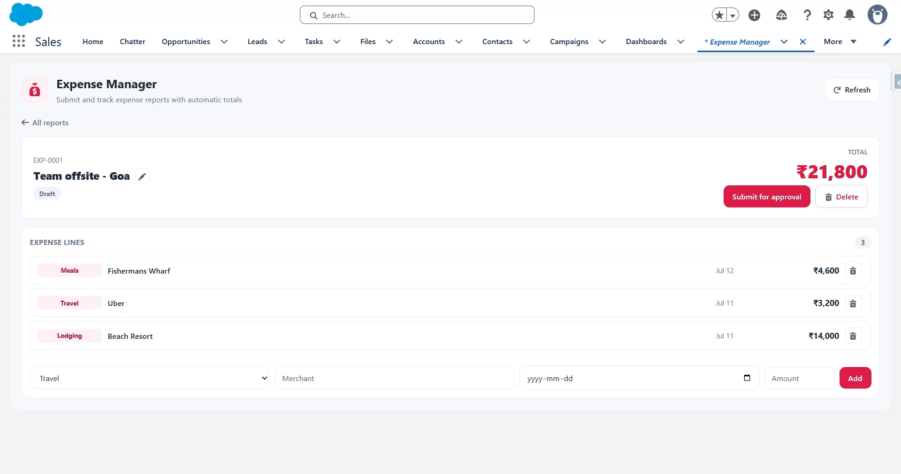

# Expense Manager — Salesforce-Native App

A **100% Salesforce** expense-management application — no external frontend or server. The entire app lives inside a Salesforce org and is built from deployable metadata: custom objects, an Apex roll-up trigger, an Approval Process, validation rules, a **Lightning Web Component** for the UI, and Apex test classes.

Employees create expense reports, add line items, and submit them for approval. A manager approves or rejects. Totals stay correct automatically, and business rules are enforced by the platform.



▶️ **[Watch the demo](https://youtu.be/9zTwGS_E7iQ)**

---

## What it demonstrates (the native Salesforce stack)

| Capability | Where |
|---|---|
| **Custom objects + master-detail** | `Expense_Report__c` ─◀ `Expense_Line__c` |
| **Apex trigger (bulk-safe roll-up)** | `ExpenseLineTrigger` → `ExpenseRollupService` keeps `Total_Amount__c` = SUM of lines |
| **Apex controller for LWC** | `ExpenseController` (`@AuraEnabled` methods) |
| **Lightning Web Component** | `expenseManager` — the in-Salesforce UI |
| **Approval Process** | `Expense Approval` — routes submitted reports to the employee's manager |
| **Validation rules** | Amount > 0; no future-dated expenses |
| **Apex tests** | `ExpenseRollupServiceTest`, `ExpenseControllerTest` |
| **Permission set** | `Expense Manager User` |

## Data model

```
Expense_Report__c  (parent)                Expense_Line__c  (child)
├── Name            Auto Number EXP-{0000} ├── Name            Auto Number EXL-{0000}
├── Status__c       Draft→Submitted→        ├── Expense_Report__c  Master-Detail
│                   Approved / Rejected     ├── Category__c     Travel / Meals / …
├── Total_Amount__c ◄── rolled up by ───────┤ Amount__c         Currency (required, > 0)
│                       the Apex trigger     ├── Expense_Date__c  Date (not future)
├── Employee__c     Lookup(User)            ├── Merchant__c
├── Submitted_Date__c                        └── Notes__c
└── Purpose__c
```

---

## Deploy

Requires the [Salesforce CLI](https://developer.salesforce.com/tools/salesforcecli) (`sf`).

```powershell
# 1. Authenticate with your org (opens a browser)
sf org login web --alias expense-org

# 2. Deploy everything and run the Apex tests
sf project deploy start --source-dir force-app --target-org expense-org --test-level RunLocalTests

# 3. Give yourself access to the objects, fields, and Apex
sf org assign permset --name Expense_Manager_User --target-org expense-org
```

### Two manual steps after deploy

Salesforce does not allow these to be automated by a deployment:

1. **Activate the approval process.** Setup → **Approval Processes** → object *Expense Report* → **Expense Approval** → *Activate*. (Approval processes always deploy inactive.)
2. **Set a Manager on your user.** The process routes to the submitter's **Manager** (standard user field). Setup → **Users** → your user → set *Manager*. Without a manager, submission has no approver.

---

## Use it

1. App Launcher → **Expense Manager** (the custom tab) — or drop the *Expense Manager* component on any Lightning App/Home page.
2. Enter a purpose and **Create report**.
3. Open the report, **add line items** (category, amount, date, merchant). The total updates via the roll-up trigger as each line is saved.
4. Try the guards: an amount of `0` or a future date is rejected by the validation rules.
5. **Submit for approval** → the report enters the approval process and its status becomes *Submitted*; the record locks.
6. As the manager (or an admin), approve/reject from the record's **Approval History** → status becomes *Approved* / *Rejected*.

---

## How the automation fits together

- **Roll-up (Apex).** `ExpenseLineTrigger` fires on line insert/update/delete/undelete and calls `ExpenseRollupService.recalculateTotals`, which does one aggregate query and one update for the whole batch — bulk-safe by design. (A native roll-up summary field could also do this; it's implemented in Apex here to demonstrate the trigger pattern and keep the logic testable.)
- **Approval (declarative).** Submitting runs the *Expense Approval* process: an initial-submission field update sets the status to *Submitted* and locks the record; final approval/rejection sets *Approved* / *Rejected*. The `expenseManager` component submits via `Approval.process()` in Apex.
- **Guards (declarative).** Validation rules on `Expense_Line__c` block non-positive amounts and future dates regardless of how a line is created.

## Testing

```powershell
sf apex run test --target-org expense-org --test-level RunLocalTests --result-format human --code-coverage
```

`ExpenseRollupServiceTest` covers the roll-up across insert / update / delete / bulk / last-line-removed; `ExpenseControllerTest` covers the controller methods the LWC calls.

## Project layout

```
force-app/main/default/
├── objects/
│   ├── Expense_Report__c/         (object + 5 fields)
│   └── Expense_Line__c/           (object + 6 fields + 2 validation rules)
├── triggers/    ExpenseLineTrigger
├── classes/     ExpenseRollupService · ExpenseController (+ tests)
├── lwc/         expenseManager     (html · js · css · meta)
├── approvalProcesses/  Expense_Report__c.Expense_Approval
├── workflows/   Expense_Report__c   (field updates used by the approval process)
├── tabs/        Expense_Manager
└── permissionsets/  Expense_Manager_User
```

## Notes

- This is a metadata-only project; it is meant to be deployed to a Salesforce org (a free [Developer Edition](https://developer.salesforce.com/signup) works). It cannot be "run" locally like a Node app.
- Currency is displayed as INR in the component; change the `currency-code` in `expenseManager.html` to match your org's currency.
