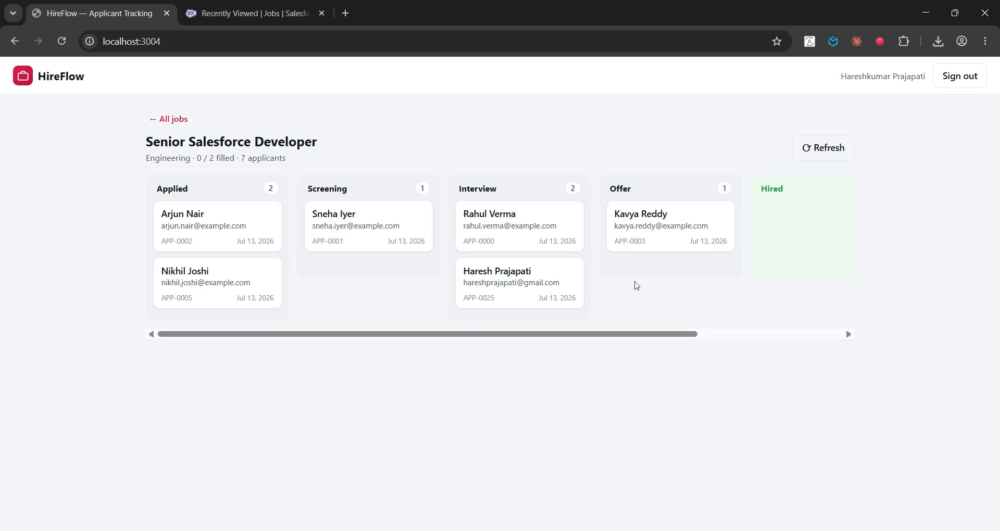

# HireFlow — Applicant Tracking System

A full-stack recruiting application built with **React** and **Salesforce**, connected through a **Node.js REST API** layer.

Candidates browse open roles and apply on a public careers page — no account required — while recruiters sign in to a console to post jobs and move applicants through a hiring pipeline on a drag-and-drop board. The data model is two **custom objects**, and the hiring rules are enforced by an **Apex trigger running inside Salesforce**.



▶️ **[Watch the demo](https://youtu.be/wE-qk_VZ2r0)** · Recruiters sign in via **OAuth 2.0 (PKCE)**.

---

## What sets this project apart: server-side automation

The other apps in this portfolio enforce rules in the Node API. HireFlow enforces its most important rule **inside Salesforce**, with an Apex trigger on `Application__c`:

1. **Auto-stamps `Stage_Changed_Date__c`** every time an application changes stage.
2. **Blocks over-hiring** — a job can never have more `Hired` applications than it has `Openings__c`.

Because the rule lives in the platform, it holds no matter how the record is changed — this React app, the Salesforce UI, the API, or a bulk data load. When a recruiter drags a candidate to **Hired** on a full role, the trigger throws, the API returns the error, and the card snaps back. The logic is bulk-safe and ships with an Apex test class.

```
Job__c (parent)                    Application__c (child)
├── Name          (Job Title)      ├── Name                Auto Number (APP-{0000})
├── Department__c                  ├── Job__c              Master-Detail → Job__c
├── Location__c                    ├── Candidate_Name__c
├── Openings__c   ◄────────────────┤ Stage__c             Applied→…→Hired / Rejected
├── Status__c     (enforced by ────┤ Stage_Changed_Date__c (set by trigger)
│                  the trigger)    ├── Phone__c
└── Description__c                  └── Cover_Note__c
```

Trigger, handler, and test are in [salesforce/force-app/main/default/](salesforce/force-app/main/default/):
`triggers/ApplicationTrigger.trigger`, `classes/ApplicationTriggerHandler.cls`, `classes/ApplicationTriggerHandlerTest.cls`.

## Architecture

```
┌──────────────────┐        ┌───────────────────────┐        ┌──────────────────┐
│     FRONTEND     │        │       API LAYER       │        │     BACKEND      │
│    React SPA     │  HTTPS │    Node / Express     │  REST  │    Salesforce    │
│                  │ ─────► │                       │ ─────► │                  │
│  Careers page    │  JSON  │  /api/public/* ────── │ ─────► │  integration     │
│  + apply form    │        │  (integration user)   │        │  user session    │
│  (no login)      │ ◄───── │                       │ ◄───── │                  │
│                  │        │  /api/admin/*  ────── │ ─────► │  per-recruiter   │
│  Recruiter board │        │  (session per admin)  │        │  session         │
│      :3004       │        │        :5004          │        │  + Apex trigger  │
└──────────────────┘        └───────────────────────┘        └──────────────────┘
```

Two access tiers: the **public** careers site runs under an integration user; the **recruiter console** uses per-user authenticated sessions.

## Tech Stack

| Tier | Technology |
|---|---|
| Frontend | React 18, Vite, HTML5 drag & drop |
| API layer | Node.js, Express, jsforce |
| Backend | Salesforce custom objects (`Job__c`, `Application__c`), master-detail, **Apex trigger + handler + test**, permission set |
| Auth | Service connection for public routes + **OAuth 2.0 (PKCE)** sessions for the recruiter console |

## Repository Structure

| Path | Description |
|---|---|
| [client/](client/) | React SPA — careers page, apply form, recruiter console, applicant board |
| [server/](server/) | Express REST API — public applications, job management, stage moves |
| [salesforce/](salesforce/) | Custom objects, **Apex trigger/handler/test**, permission set, setup guide |

---

## Getting Started

### 1. Deploy the Salesforce data model + Apex (one-time)

Follow [salesforce/README.md](salesforce/README.md). With the Salesforce CLI:

```powershell
cd salesforce
sf project deploy start --source-dir force-app --target-org <your-org>
sf org assign permset --name HireFlow_Admin --target-org <your-org>
```

The deploy includes the Apex trigger and runs its tests. (The Apex requires the CLI or Developer Console — it can't be created through point-and-click, unlike the custom objects.)

### 2. Run the API server

```powershell
cd server
copy .env.example .env    # then fill in SF_ORG + SF_CLIENT_ID (Connected App consumer key)
npm install
npm run dev
```

The API starts on `http://localhost:5004`.

### 3. Run the frontend

```powershell
cd client
npm install
npm run dev
```

The app is served at `http://localhost:3004`.

### 4. See the trigger in action

1. Sign in as a recruiter and post a job with **Openings = 1**.
2. On the public careers page, apply as two different candidates.
3. Open the job's **Pipeline**, drag the first candidate to **Hired** — succeeds.
4. Drag the second candidate to **Hired** — the Apex trigger blocks it, the error appears, and the card snaps back.
5. In Salesforce, open the application and note `Stage Changed Date` was set automatically.

---

## API Reference

### Public (no authentication)

| Method | Endpoint | Description |
|---|---|---|
| `GET` | `/api/public/jobs` | Open roles with applicant counts |
| `POST` | `/api/public/jobs/:id/apply` | Submit an application (rejects duplicates / closed roles) |

### Admin (`Authorization: Bearer <sessionId>`)

| Method | Endpoint | Description |
|---|---|---|
| `GET` · `POST` | `/api/auth/login` · `/logout` | Recruiter OAuth 2.0 (PKCE) login & logout |
| `GET` | `/api/admin/jobs` | All jobs with applicant & hired counts |
| `POST` / `PATCH` / `DELETE` | `/api/admin/jobs[/:id]` | Manage jobs |
| `GET` | `/api/admin/jobs/:id/applications` | A job's applicant pipeline |
| `PATCH` | `/api/admin/applications/:id` | Move an applicant to a new stage* |
| `DELETE` | `/api/admin/applications/:id` | Remove an application |

*A move to `Hired` beyond openings is rejected by the Apex trigger; the API returns `409` with the trigger's message.

### Integration notes

- **Automation lives in Salesforce**, not the API — the over-hiring rule can't be bypassed by calling the API directly.
- **Duplicate & closed-role guards** on the public apply endpoint return `409`.
- **SOQL injection** is guarded by record-ID validation and string-literal escaping.
- Applications are `Application__c` records tied to `Job__c` by master-detail, so deleting a job cascade-deletes its applications.

## Security Notes

- Salesforce tokens (both tiers) exist only server-side; browsers hold at most an opaque session ID.
- The integration user should be a **least-privilege account** in production.
- Sessions are in-memory; use a shared store (e.g. Redis) and HTTPS end-to-end for production.

## Roadmap

- Interview scheduling (Events) per application
- Email notifications on stage changes (extend the Apex trigger / platform events)
- Resume file uploads (Salesforce Files / ContentVersion)
- Email notifications to candidates on stage changes
