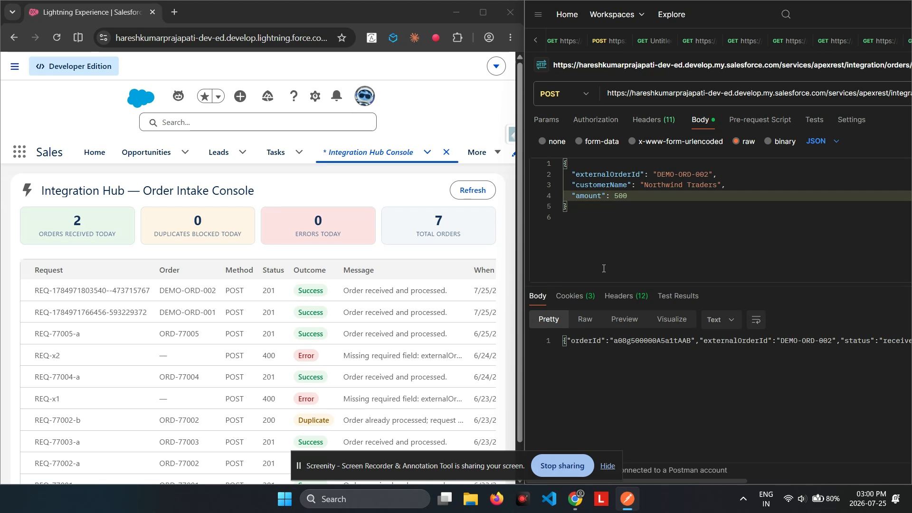

# IntegrationHub — Inbound Order Intake API

A **Salesforce solution** that exposes a real, externally-callable REST API — the kind an e-commerce site or ERP system would call directly into Salesforce — with the idempotency and observability a production integration actually needs.



---

## The client problem

> "We need our website to push orders straight into Salesforce the moment they're placed — no middleware, no manual entry. But webhooks retry. Networks hiccup. If the same order gets delivered twice, we can't end up with two records. And when something *does* go wrong, we need to be able to see exactly what happened — not dig through debug logs."

## The solution, at a glance

- A **custom Apex REST endpoint** (`/services/apexrest/integration/orders`) that external systems POST orders to directly — no Salesforce login flow required beyond a standard OAuth token.
- **Idempotent by design**: every order carries an `External_Order_Id__c` — the calling system's own identifier — enforced unique at the database level. A retried or duplicated delivery is detected and safely ignored, not double-processed.
- Every call — success, duplicate, or error — is **logged** to a monitoring object with the HTTP outcome, so a support engineer can see exactly what happened without touching debug logs.
- A successful order **publishes a Platform Event**, so other systems inside the org (a fulfillment process, a notification service) can react without polling.
- A live **monitoring console** shows KPI tiles and a real-time-refreshable log of every integration call.

## High-level structure (separation of concerns)

```
┌──────────────────────────────────────────────────────────────────────┐
│  INBOUND     OrderIntakeService  (@RestResource — external systems     │
│              POST here; idempotency check; Platform Event publish)     │
├──────────────────────────────────────────────────────────────────────┤
│  UI          integrationConsole (LWC) ─► IntegrationConsoleController  │
├──────────────────────────────────────────────────────────────────────┤
│  DATA        Integration_Order__c   (the order, keyed by external id)  │
│              Integration_Log__c     (every call, success/dup/error)    │
│  EVENT       Order_Received__e      (Platform Event, for downstream)   │
└──────────────────────────────────────────────────────────────────────┘
```

## How an order flows

```
External system POSTs { externalOrderId, customerName, amount }
   └► OrderIntakeService.receiveOrder()
        ├─ externalOrderId already seen? → log "Duplicate", respond 200, stop (idempotent)
        ├─ missing required field?       → log "Error", respond 400
        └─ otherwise:
             ├► insert Integration_Order__c
             ├► EventBus.publish(Order_Received__e)   (downstream systems can subscribe)
             ├► log "Success"
             └► respond 201 with the new record's Id
```

---

## Deploy

```powershell
sf org login web --alias integrationhub-org
sf project deploy start --source-dir force-app --target-org integrationhub-org --test-level RunLocalTests
sf org assign permset --name IntegrationHub_User --target-org integrationhub-org
```

## Use it

1. Get an access token for your org (e.g. `sf org display --target-org integrationhub-org --json`).
2. POST an order:
   ```bash
   curl -X POST "<instance-url>/services/apexrest/integration/orders/" \
     -H "Authorization: Bearer <access-token>" -H "Content-Type: application/json" \
     -d '{"externalOrderId":"EXT-1001","customerName":"Northwind Traders","amount":1499.50}'
   ```
3. Send the **exact same request again** — you'll get back `{"status":"duplicate"}` with a `200`, and no second record is created.
4. Open the **Integration Hub Console** tab to see both calls logged, with live KPI tiles for orders received, duplicates blocked, and errors.

## Verified live

- **6/6 Apex tests pass**, 92–100% code coverage.
- Proven with **real external HTTP calls** (curl, not mocked) against the deployed org:
  - A genuine new order → **`201 Created`**
  - The identical request replayed → **`200`**, `"duplicate"`, no second record
  - A request missing a required field → **`400`** with a clean validation message

## Testing

```powershell
sf apex run test --target-org integrationhub-org --test-level RunLocalTests --result-format human --code-coverage
```

Tests cover the REST endpoint (new order, duplicate detection, missing-field validation) using real `RestContext.request`/`RestResponse` objects, plus the console controller's summary and log queries.

## Project layout

```
force-app/main/default/
├── objects/
│   ├── Integration_Order__c   (External_Order_Id__c is unique + external ID — the idempotency key)
│   └── Integration_Log__c     (Endpoint, HTTP method, status code, outcome, message)
├── classes/
│   ├── OrderIntakeService                     (the @RestResource inbound endpoint)
│   ├── IntegrationConsoleController            (monitoring console UI layer)
│   └── *Test
├── lwc/  integrationConsole
├── tabs/  IntegrationHub_Console
└── permissionsets/  IntegrationHub_User
```

## Notes & caveats

- Calling the endpoint requires a valid Salesforce OAuth access token — this mirrors how real B2B integrations authenticate (named-principal OAuth), rather than an anonymous public endpoint, which would need an Experience Cloud Site and adds meaningful setup complexity for a portfolio build.
- The idempotency key (`External_Order_Id__c`) is enforced with a database-level unique constraint, not just an application-level check — that's what makes it race-condition-safe under concurrent duplicate deliveries, not merely "usually correct."
