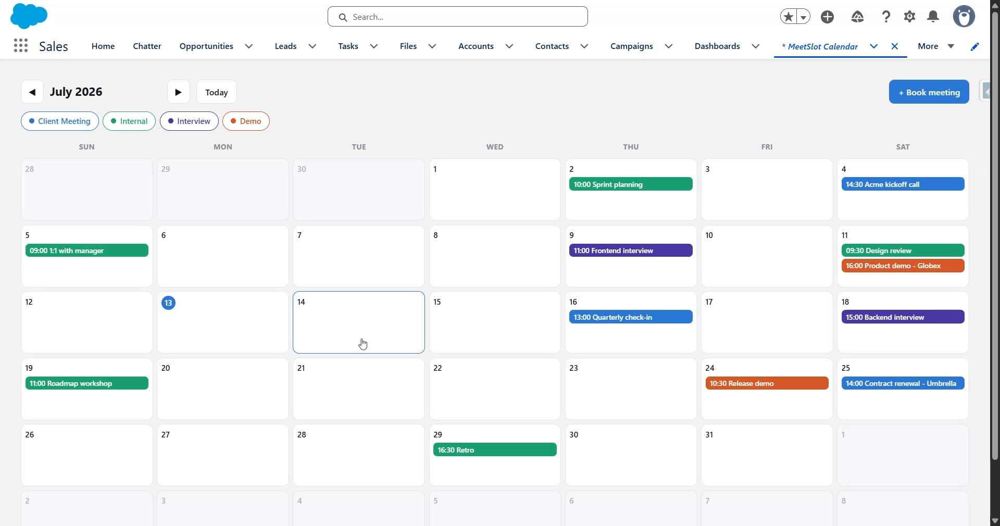

# MeetSlot — React Team Calendar Inside Salesforce

A monthly team calendar **written in React and hosted entirely inside Salesforce**. Like ProjectBoard, there is no external server or hosting: the React app is bundled into a single JavaScript file, uploaded as a **Static Resource**, loaded by a thin **Lightning Web Component**, and talks to Salesforce through **Apex**. Meetings live in a `Meeting__c` custom object.



▶️ **[Watch the demo](https://youtu.be/w8g1pQIpkQ0)**

---

## The architecture

```
   react-app/  (Vite)                       salesforce/  (SFDX)
 ┌───────────────────┐   npm run build    ┌──────────────────────────────┐
 │  React source     │ ─────────────────► │  staticresources/            │
 │  App.jsx          │  single IIFE        │    meetSlot.js   (bundle)    │
 │  (month calendar) │  bundle             │                              │
 └───────────────────┘                     │  lwc/meetSlot  (host)        │
                                           │    loadScript(meetSlot)      │
   window.MeetSlotApp                      │    mount(el, api)            │
     .mount(el, api) ◄──────────────────── │      ▲                       │
     .unmount(el)                          │      │ api bridge            │
                                           │      ▼                       │
                                           │  MeetSlotController (Apex)   │
                                           │      ▼                       │
                                           │  Meeting__c  (data)          │
                                           └──────────────────────────────┘
```

React never references Salesforce — it calls `api.getMeetings(year, month)`, `api.createMeeting(data)`, etc. The LWC host wires that bridge to `@AuraEnabled` Apex.

## What the calendar does

- **Month grid** (6 weeks, leading/trailing days dimmed, today highlighted) with **◀ / ▶ / Today** navigation — each month change re-queries Apex for just that month's records.
- **Event chips** on each day, color-coded by meeting type (Client Meeting / Internal / Interview / Demo) with a **type filter** row; overflowing days show "+n more".
- **Click a day to book**: subject, date, start time, duration, type, attendees, notes → creates a `Meeting__c`.
- **Click an event** for details and **Cancel meeting** (delete).
- **Seed sample data** creates eight demo meetings spread across the *current* month, so the board is alive immediately.

## Data model

```
Meeting__c
├── Name                 Subject
├── Meeting_Date__c      Date (required)
├── Start_Time__c        Time
├── Duration_Minutes__c  Number
├── Type__c              Client Meeting / Internal / Interview / Demo
├── Attendees__c         Text
└── Notes__c             Long text
```

A worthwhile detail: `Start_Time__c` uses Salesforce's **Time** field type. Apex serializes it as `"HH:mm:ss.SSSZ"`; the React side displays `HH:mm`, and the create path sends `"HH:mm"` which Apex parses with `Time.newInstance`.

---

## Build & Deploy

### 1. Build the React bundle

```powershell
cd react-app
npm install
npm run build     # writes salesforce/.../staticresources/meetSlot.js
```

> Re-run the build whenever you change React code, then redeploy. The built bundle is committed as metadata, so a deploy alone suffices if React didn't change.

### 2. Deploy to Salesforce

```powershell
cd ../salesforce
sf org login web --alias meetslot-org
sf project deploy start --source-dir force-app --target-org meetslot-org --test-level RunLocalTests
sf org assign permset --name MeetSlot_User --target-org meetslot-org
```

### 3. Use it

App Launcher → **MeetSlot Calendar** (custom tab), or drop the *MeetSlot Calendar (React)* component on any Lightning App/Home page. Click **Seed sample data**, browse months, click a day to book, click an event to view/cancel. Records are ordinary Salesforce data — check **App Launcher → Meetings** to see them as records too.

## Testing

```powershell
cd salesforce
sf apex run test --target-org meetslot-org --test-level RunLocalTests --result-format human --code-coverage
```

`MeetSlotControllerTest` covers seeding (idempotent), month-window filtering (a next-month meeting is excluded), JSON-payload creation including the `HH:mm` → `Time` parse, the missing-field guard, and deletion.

## Project layout

```
MeetSlot/
├── react-app/                     # React source + Vite build tooling
│   └── src/ App.jsx · main.jsx · styles.js
└── salesforce/                    # deployable SFDX project
    └── force-app/main/default/
        ├── staticresources/  meetSlot.js (+ meta)     ← built bundle
        ├── lwc/meetSlot      (host: js · html · meta)
        ├── classes/  MeetSlotController (+ test)
        ├── objects/Meeting__c/  (object + 6 fields)
        ├── tabs/  MeetSlot_Calendar
        └── permissionsets/  MeetSlot_User
```

## Notes & caveats

- **The bundle is committed.** `staticresources/meetSlot.js` is build output, checked in so the org gets it — rebuild after React changes.
- **Light DOM host** (`renderMode = 'light'`), same pattern as ProjectBoard; fine under Lightning Web Security.
- I verified the bundle **builds** and exposes `window.MeetSlotApp`, and all metadata is well-formed — but this hasn't been deployed to a live org; a real `sf project deploy start` is the final confirmation.
