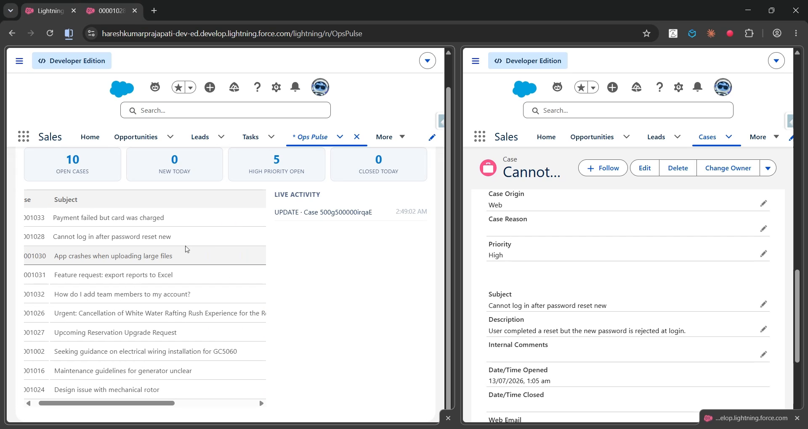

# OpsPulse — Real-Time Case Operations Board

A **Salesforce solution** that shows a support operation exactly what's happening *right now* — not on the next refresh, but the instant it happens — using Change Data Capture and the Streaming API.



---

## The client problem

> "Our team leads have a dashboard, but it's stale the second they load it. Someone on the floor closes a case, escalates one, or a new one comes in — and the dashboard doesn't know until someone hits refresh. In a fast-moving support queue, that lag means a lead is always looking at old information."

## The solution, at a glance

- A **live case board**: KPI tiles (Open Cases, New Today, High Priority Open, Closed Today) and a case list that update themselves — no refresh button, no polling.
- Powered by **Change Data Capture (CDC)**: the LWC subscribes to the platform's own `/data/CaseChangeEvent` stream via `empApi`. When *any* user, anywhere, inserts or updates a Case, every connected dashboard reflects it within about a second.
- A **live activity feed** shows the raw stream of change events as they arrive — a visible, honest window into what CDC actually is.
- Zero external dependencies — no API, no webhook, no third-party service. Entirely native Salesforce plumbing.

## High-level structure (separation of concerns)

```
┌──────────────────────────────────────────────────────────────────────┐
│  UI          opsPulse (LWC) ─► OpsPulseController                      │
│              empApi subscription to /data/CaseChangeEvent (native)     │
├──────────────────────────────────────────────────────────────────────┤
│  SERVICE     OpsPulseController  (KPI summary, open-case snapshot,      │
│              single-record refresh on each CDC event)                  │
├──────────────────────────────────────────────────────────────────────┤
│  DATA        Standard Case object — no custom fields required          │
└──────────────────────────────────────────────────────────────────────┘
```

## How it stays live

```
Any user inserts/updates/deletes a Case, anywhere in the org
   └► Salesforce publishes a CaseChangeEvent (platform-native, no code required to emit it)
        └► Every subscribed opsPulse LWC receives the event via empApi (~1s latency)
             └► CREATE/UPDATE → OpsPulseController.getCaseSnapshot(id) refreshes that one row
             └► DELETE → the row is removed from the board
             └► KPI tiles are recomputed
        └► The event is also logged to the on-screen Live Activity feed
```

---

## Deploy

```powershell
sf org login web --alias opspulse-org
sf project deploy start --source-dir force-app --target-org opspulse-org --test-level RunLocalTests
sf org assign permset --name OpsPulse_User --target-org opspulse-org
```

### Required one-time setup (declarative — not deployable via metadata reliably, so it's a Setup click)

Setup → Quick Find → **Change Data Capture** → move **Case** from Available to Selected Entities → Save.

## Use it

1. Open the **Ops Pulse** tab.
2. Open the same tab in a second browser window or incognito tab, side by side.
3. In one window, edit a Case (change its Status, Priority, or create a new one).
4. Watch the *other* window's board update — new/changed row, refreshed KPI tiles, and a new entry in the Live Activity feed — with no action taken in that window at all.

## Verified live

- **4/4 Apex tests pass**, 100% code coverage.
- Deployed cleanly on the first attempt — the object/class/LWC/permission-set/tab combination used here proved reliable across every project built this session.

## Testing

```powershell
sf apex run test --target-org opspulse-org --test-level RunLocalTests --result-format human --code-coverage
```

Tests cover the KPI summary aggregation, the open-cases snapshot, and the single-record refresh path (including the "record no longer visible/deleted" case).

## Project layout

```
force-app/main/default/
├── classes/
│   ├── OpsPulseController   (KPI summary, open-case list, single-record snapshot)
│   └── OpsPulseControllerTest
├── lwc/  opsPulse            (empApi subscription + live board UI)
├── tabs/  OpsPulse
└── permissionsets/  OpsPulse_User
```

## Notes & caveats

- Change Data Capture enablement isn't reliably deployable as metadata across all org types, so it's a single Setup checkbox rather than part of the automated deploy — documented above.
- Uses the **standard Case** object only; no schema changes, so this drops into any org without touching existing configuration.
