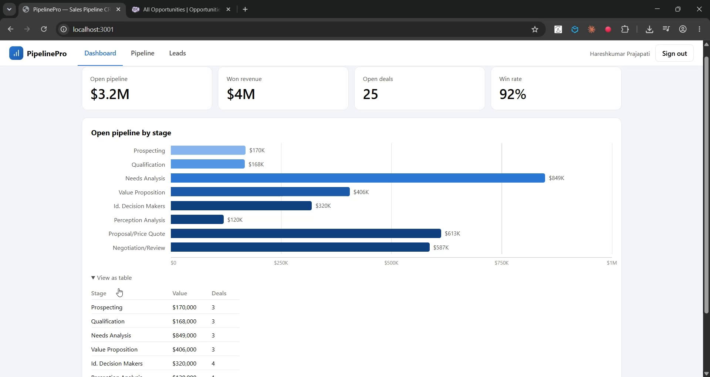

# PipelinePro — Sales Pipeline CRM

A full-stack sales pipeline management application built with **React** and **Salesforce Sales Cloud**, connected through a secure **Node.js REST API** layer.

Sales teams capture and qualify **Leads**, convert them into deals, and manage **Opportunities** on a drag-and-drop Kanban board — with a live dashboard aggregating pipeline value, won revenue, and win rate directly from Salesforce.



▶️ **[Watch the demo](https://youtu.be/0L7V5gsDOWQ)** · Sign in with real Salesforce credentials via **OAuth 2.0 (PKCE)**.

---

## Features

- **Pipeline dashboard** — KPI tiles (open pipeline, won revenue, open deals, win rate) and a pipeline-by-stage chart, computed server-side with SOQL aggregate queries.
- **Kanban deal board** — Opportunities grouped by stage; dragging a card to another column updates the deal's stage in Salesforce in real time.
- **Lead management** — capture leads from a web form, track qualification status, and **convert** them (Account + Contact + Opportunity created in one transaction via the Salesforce SOAP `convertLead` call — the same operation as the native Convert button).
- **Full CRUD** on deals and leads, all persisted as standard Sales Cloud records.

## Architecture

```
┌─────────────────┐        ┌──────────────────┐        ┌──────────────────┐
│    FRONTEND     │        │    API LAYER     │        │     BACKEND      │
│    React SPA    │  HTTPS │  Node / Express  │  REST  │    Salesforce    │
│                 │ ─────► │                  │ ─────► │   Sales Cloud    │
│  Dashboard      │  JSON  │  Session mgmt    │  SOAP  │                  │
│  Kanban board   │ ◄───── │  Salesforce      │ ◄───── │  Lead            │
│  Lead console   │        │  integration     │        │  Opportunity     │
│                 │        │  (jsforce)       │        │  Account/Contact │
│    :3001        │        │      :5001       │        │  *.salesforce.com│
└─────────────────┘        └──────────────────┘        └──────────────────┘
```

The frontend is fully decoupled from Salesforce — it consumes only the internal REST API. Credentials and access tokens are confined to the server tier; the browser holds only an opaque session ID.

> Ports 3001/5001 are used so PipelinePro can run side-by-side with the ServiceDesk application (3000/5000).

## Tech Stack

| Tier | Technology |
|---|---|
| Frontend | React 18, Vite, native HTML5 drag & drop |
| API layer | Node.js, Express, jsforce (REST + SOAP) |
| Backend / CRM | Salesforce Sales Cloud (Lead, Opportunity, Account, Contact) |
| Auth | OAuth 2.0 web-server flow (Authorization Code + PKCE) |

## Repository Structure

| Path | Description |
|---|---|
| [client/](client/) | React single-page application (dashboard, pipeline board, leads console) |
| [server/](server/) | Express REST API — authentication, deals, leads, conversion, aggregate stats |
| [salesforce/](salesforce/) | Salesforce configuration guide |

---

## Getting Started

### Prerequisites

- Node.js 18+
- A Salesforce org (a free [Developer Edition](https://developer.salesforce.com/signup) works) and a **Connected App** (OAuth enabled, PKCE required, callback `http://localhost:5001/api/auth/callback`) — see [salesforce/README.md](salesforce/README.md)

### 1. Run the API server

```powershell
cd server
copy .env.example .env
npm install
npm run dev
```

The API starts on `http://localhost:5001`.

### 2. Run the frontend

```powershell
cd client
npm install
npm run dev
```

The app is served at `http://localhost:3001` (API requests are proxied to port 5001 in development).

### 3. Sign in

Click **Log in with Salesforce** — you authenticate on Salesforce's own hosted page via the
**OAuth 2.0 web-server flow with PKCE**; the app never sees your password, and access tokens stay
server-side. Deals and leads created in PipelinePro appear immediately in Salesforce under
**Sales → Opportunities / Leads**, and vice versa.

---

## API Reference

All business endpoints require an `Authorization: Bearer <sessionId>` header obtained from the login endpoint.

| Method | Endpoint | Description |
|---|---|---|
| `POST` | `/api/auth/login` | Authenticate against Salesforce; returns a session ID and user profile |
| `POST` | `/api/auth/logout` | Invalidate the current session |
| `GET` | `/api/opportunities` | List deals (Opportunities) with account, stage, amount |
| `POST` | `/api/opportunities` | Create a deal |
| `PATCH` | `/api/opportunities/:id` | Update a deal (stage moves from the Kanban board land here) |
| `DELETE` | `/api/opportunities/:id` | Delete a deal |
| `GET` | `/api/leads` | List unconverted leads |
| `POST` | `/api/leads` | Capture a lead |
| `PATCH` | `/api/leads/:id` | Update lead status |
| `POST` | `/api/leads/:id/convert` | Convert lead → Account + Contact + Opportunity |
| `DELETE` | `/api/leads/:id` | Delete a lead |
| `GET` | `/api/stats` | Aggregated dashboard metrics (SOQL `GROUP BY` on stage) |
| `GET` | `/api/health` | Service health check |

### Integration notes

- **Stage moves**: dropping a card on a Kanban column issues `PATCH /api/opportunities/:id { stage }`, which maps to a single-field `UPDATE` on `Opportunity.StageName`.
- **Lead conversion** uses the SOAP API (`convertLead`) because Salesforce exposes conversion only there — a realistic example of mixing REST and SOAP in one integration.
- **Dashboard metrics** are computed inside Salesforce with aggregate SOQL (`SUM`, `COUNT`, `GROUP BY`), so no raw records cross the wire for the stats view.

## Security Notes

- Salesforce access tokens are held in server-side session state only; the browser receives an opaque, randomly generated session ID.
- Sessions are stored in memory for simplicity — substitute a shared store (e.g. Redis) and enable HTTPS end-to-end for production deployment.
- Login uses the **OAuth 2.0 Connected App** web-server flow with **PKCE** — no client secret in the browser, and the entire auth contract is confined to `/api/auth/*`.

## Roadmap

- OAuth 2.0 Connected App authentication
- Account & Contact detail views
- Forecasting view (expected revenue = amount × probability)
- Activity timeline (Tasks/Events) per deal
