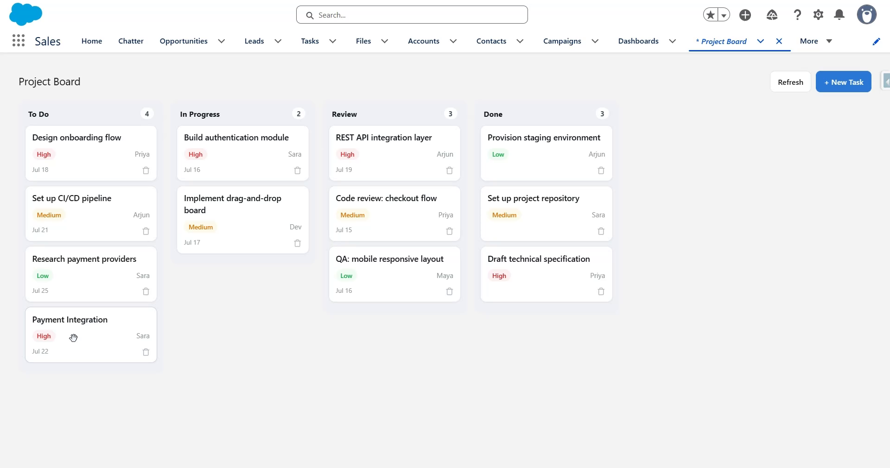

# Project Board — React Bundled Inside Salesforce

A drag-and-drop project Kanban board **written in React and hosted entirely inside Salesforce**. Unlike a normal full-stack app, there is **no separate server or hosting** — the React app is bundled into a single JavaScript file, uploaded as a **Static Resource**, loaded by a thin **Lightning Web Component**, and talks to Salesforce through **Apex**.



▶️ **[Watch the demo](https://youtu.be/6F_RijDx6nA)**

---

## The architecture

```
   react-app/  (Vite)                       salesforce/  (SFDX)
 ┌───────────────────┐   npm run build    ┌──────────────────────────────┐
 │  React source     │ ─────────────────► │  staticresources/            │
 │  App.jsx (Kanban) │  single IIFE        │    projectBoard.js  (bundle) │
 │  main.jsx         │  bundle             │                              │
 └───────────────────┘                     │  lwc/projectBoard  (host)    │
                                           │    loadScript(projectBoard)  │
   window.ProjectBoardApp                  │    mount(el, api)            │
     .mount(el, api) ◄──────────────────── │      ▲                       │
     .unmount(el)                          │      │ api bridge            │
                                           │      ▼                       │
                                           │  ProjectBoardController (Apex)│
                                           │      ▼                       │
                                           │  Project_Task__c  (data)     │
                                           └──────────────────────────────┘
```

- **React** is built by Vite in **library / IIFE mode** into one self-contained file (React + ReactDOM included) that exposes `window.ProjectBoardApp.mount(el, api)` and `.unmount(el)`.
- That file is a **Static Resource** (`projectBoard`).
- The **`projectBoard` LWC** (Light DOM) loads it with `loadScript`, then mounts React into a `<div>` and passes an **`api` bridge** — a set of async functions that call Apex.
- **React never references Salesforce.** It just calls `api.getTasks()`, `api.updateStage(id, stage)`, etc. Swap the bridge and the same React app runs anywhere.

## Why this pattern

It's how teams reuse an existing React app inside Salesforce, or build a UI too custom/rich for native LWC (here: fluid HTML5 drag-and-drop across columns). You get React's ecosystem and developer experience, deployed as ordinary Salesforce metadata that runs in Lightning Experience.

---

## Project layout

```
ProjectBoard/
├── react-app/                     # the React source (build tooling)
│   ├── src/ App.jsx · main.jsx · styles.js
│   └── vite.config.js             # outputs the bundle into salesforce/…/staticresources
└── salesforce/                    # the deployable SFDX project
    └── force-app/main/default/
        ├── staticresources/  projectBoard.js  (+ .resource-meta.xml)   ← the built bundle
        ├── lwc/projectBoard  (host: js · html · meta)
        ├── classes/  ProjectBoardController (+ test)
        ├── objects/Project_Task__c/  (object + 5 fields)
        ├── tabs/  Project_Board
        └── permissionsets/  Project_Board_User
```

## Build & Deploy

### 1. Build the React bundle

```powershell
cd react-app
npm install
npm run build     # writes salesforce/.../staticresources/projectBoard.js
```

> Re-run `npm run build` whenever you change the React code, then redeploy the static resource. The built bundle is committed as metadata, so a deploy alone is enough if you haven't changed React.

### 2. Deploy to Salesforce

```powershell
cd ../salesforce
sf org login web --alias board-org
sf project deploy start --source-dir force-app --target-org board-org --test-level RunLocalTests
sf org assign permset --name Project_Board_User --target-org board-org
```

### 3. Use it

App Launcher → **Project Board** (custom tab), or drop the *Project Board (React)* component on any Lightning App/Home page. Click **Seed sample data**, then drag cards between **To Do → In Progress → Review → Done** — each drop calls Apex to persist the new stage. Add tasks with **+ New Task**; delete with the 🗑 on a card.

---

## Data model

```
Project_Task__c
├── Name           Task title
├── Stage__c       To Do / In Progress / Review / Done
├── Assignee__c    Text
├── Priority__c    High / Medium / Low
├── Due_Date__c    Date
└── Description__c  Long text
```

## Testing

```powershell
cd salesforce
sf apex run test --target-org board-org --test-level RunLocalTests --result-format human --code-coverage
```

`ProjectBoardControllerTest` covers seeding, JSON-payload task creation, the title guard, stage updates, deletion, and the invalid-stage guard.

## Notes & caveats

- **The bundle is committed.** `salesforce/.../staticresources/projectBoard.js` is the output of `npm run build`; it's checked in so the org has it. Rebuild after React changes.
- **Light DOM host.** The LWC uses `renderMode = 'light'` so React's DOM and its injected `<style>` behave like a normal page. Under Lightning Web Security (the modern default) React runs fine; very old orgs still on Locker Service may need LWS enabled.
- **Metadata-only deploy target.** The `salesforce/` folder deploys to an org (a free [Developer Edition](https://developer.salesforce.com/signup) works). The `react-app/` folder is a build tool, not something you deploy.
- I verified the React bundle **builds** and exposes the global mount API, and that all metadata is well-formed — but this hasn't been deployed to a live org, so a real `sf project deploy start` is the final confirmation.
