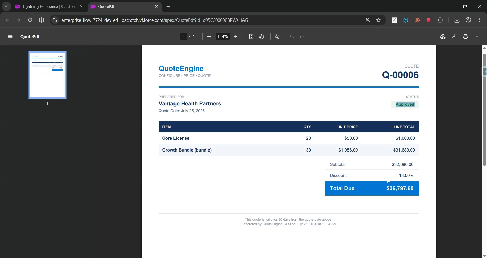

# QuoteEngine — CPQ-Lite Quote Configurator

A **Salesforce solution** that builds quotes from a real product catalog with bundles and volume pricing, routes large discounts for approval, and generates an actual downloadable PDF — the "quote" half of the quote-to-cash lifecycle that [BillingHub](../BillingHub) bills and collects on.



---

## The client problem

> "Our reps build quotes in a spreadsheet. Bundle pricing is whatever the rep remembers it should be, volume discounts are applied by feel, and there's no check on how much discount someone can just... give away. And every quote ends as a screenshot of a spreadsheet emailed to the customer — it doesn't look like it came from a real company."

## The solution, at a glance

- A real **product catalog** with **bundles** — a named group of products at a bundle-level discount, priced automatically from its component products' live prices.
- A **volume-discount rules engine**: tiered discount rates based on total quantity on the quote, stored as plain data records (not hidden in code, not a fragile Custom Metadata Type) so an admin tunes pricing from the console.
- **Quotes above a discount threshold require approval** — the same authorization-gate pattern used in BillingHub's refunds, applied here to pricing exceptions.
- A real, **downloadable PDF quote document**, generated server-side via Visualforce — not a screenshot, an actual formatted document a customer would recognize as a real quote.

## High-level structure (separation of concerns)

```
┌──────────────────────────────────────────────────────────────────────┐
│  UI          quoteEngineConsole (LWC) ─► QuoteEngineController         │
├──────────────────────────────────────────────────────────────────────┤
│  ENGINE      DiscountRuleService   (volume-tier discount lookup)       │
├──────────────────────────────────────────────────────────────────────┤
│  DOCUMENT    QuotePdf.page (Visualforce, renderAs="pdf")                │
│              ─► QuotePdfController                                     │
├──────────────────────────────────────────────────────────────────────┤
│  DATA        Product__c · Bundle__c · Bundle_Item__c ·                 │
│              Discount_Tier__c · Quote__c · Quote_Line__c               │
└──────────────────────────────────────────────────────────────────────┘
```

## How a quote is priced (the distinctive pattern)

```
Add a product line   → Line price = Product.Unit_Price__c × Quantity  (snapshotted)
Add a bundle line     → Bundle price = Σ(bundle item price × its quantity) × (1 − bundle discount %)
                         Line price = bundle price × how many sets requested

Recalculate:
   Subtotal   = Σ every line's total
   Total Qty  = Σ every line's quantity
   Discount % = DiscountRuleService — richest Discount_Tier__c the total quantity qualifies for
   Total      = Subtotal × (1 − Discount % / 100)

Submit for approval:
   Discount % ≥ 15%  → Status = Pending Approval  (a human decides)
   Discount % < 15%  → Status = Approved           (auto-approved)
```

## The PDF (a real document, not a screenshot)

`QuotePdfController` loads a quote and its lines by Id; `QuotePdf.page` renders them through a styled Visualforce template with `renderAs="pdf"` — Salesforce generates a genuine PDF file server-side. The console's **View PDF** button opens it in a new tab.

---

## Deploy

```powershell
sf org login web --alias quoteengine-org
sf project deploy start --source-dir force-app --target-org quoteengine-org --test-level RunLocalTests
sf org assign permset --name QuoteEngine_User --target-org quoteengine-org
```

## Use it

1. Add a few **Products** and a **Bundle** (with **Bundle Items** referencing those products) and some **Discount Tiers** (e.g. 20+ units → 10%, 50+ units → 18%).
2. Open the **Quote Engine Console**. Click **New Quote**, enter a customer name in the modal, and save — it opens straight into that quote's detail modal.
3. Add a product and a bundle to it — the Subtotal, Discount %, and Total stat tiles and the line-items table update live as each line is added, no manual reload.
4. Click **Submit for Approval** — a quote under the threshold auto-approves; a large one lands in **Pending Approvals** for a decision.
5. Once a quote is **Approved**, click **View PDF** — a real, downloadable, Salesforce-blue-themed quote document opens in a new tab (Draft/Pending/Rejected quotes don't expose a PDF, since they aren't a finalized document yet).

## Verified live

- **16/16 Apex tests pass**, 98% org-wide coverage.
- Deployed successfully after two quick, real fixes: a Visualforce test needed `ApexPages.currentPage()` instead of a nonexistent `Test.currentPageReference()` method, and the two child objects in Master-Detail relationships needed `ControlledByParent` sharing (not an explicit `ReadWrite` value).
- A quote was built live against the deployed org — a bundle (12% bundle discount) plus a product line computed to an exact **$3,112 subtotal**, correctly auto-approved at 0% volume discount (below the 15% threshold since the tested quantity was under the lowest tier) — confirming the pricing math is correct end to end, not just unit-tested in isolation.
- Fixed a real caching bug during the build: `getQuoteLines` was marked `cacheable=true`, and Lightning's client-side Apex cache applies even to imperative (non-`@wire`) calls — so newly-added lines wouldn't show until a full page reload. Removing the flag fixed it.
- The PDF template went through two real rendering-engine lessons: a class-based `<style>` stylesheet silently wasn't applied by Salesforce's `renderAs="pdf"` engine at all (inline `style=""` on every element is the reliable pattern), and `apex:repeat` doesn't support `varStatus` (row striping is computed in Apex instead).

## Testing

```powershell
sf apex run test --target-org quoteengine-org --test-level RunLocalTests --result-format human --code-coverage
```

Tests cover the discount rules engine (no-match, mid-tier, richest-tier, inactive-tier-ignored), the quote controller (product lines, bundle pricing math, volume discount application, the approval threshold in both directions, and the approve/reject decision), and the PDF controller (loads correctly, and doesn't throw on a missing or malformed Id).

## Project layout

```
force-app/main/default/
├── objects/
│   ├── Product__c            (Unit Price, Category)
│   ├── Bundle__c              (Bundle Discount Percent)
│   ├── Bundle_Item__c         (Master-Detail to Bundle__c; Product + Quantity)
│   ├── Discount_Tier__c       (Min Quantity, Discount Percent, Active — plain data, not Custom Metadata)
│   ├── Quote__c                (Status, Subtotal, Discount %, Total, Approval Notes)
│   └── Quote_Line__c           (Master-Detail to Quote__c; snapshotted price + total)
├── classes/
│   ├── DiscountRuleService                  (volume-tier discount engine)
│   ├── QuoteEngineController                 (lines, recalculation, approval, decision)
│   ├── QuotePdfController                    (backs the PDF page)
│   └── *Test
├── pages/  QuotePdf.page       (renderAs="pdf")
├── lwc/  quoteEngineConsole
├── tabs/  QuoteEngine_Console
└── permissionsets/  QuoteEngine_User
```

## Notes & caveats

- **Discount tiers are plain `Discount_Tier__c` data records, not a Custom Metadata Type.** This was a deliberate choice: Custom Metadata Type deploys proved unreliable on one of the orgs used this session, while ordinary custom object records deploy and update just as easily from the console — with the added benefit of not requiring a fresh deployment to add or change a tier at all.
- **Quote approval is a permission-gated Apex service**, the same pattern used in BillingHub's refund approvals — not a native declarative Approval Process. See BillingHub's README for the reasoning.
- Pairs naturally with **BillingHub**: an approved QuoteEngine quote is the natural input to a BillingHub `Subscription__c` — together they cover the full quote → bill → collect → retain revenue lifecycle.
