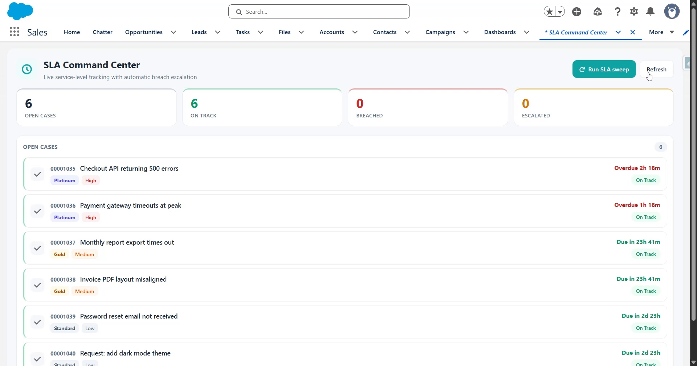

# ServiceSLA — SLA-Driven Support Case Management

A **Salesforce solution** to a real client problem, built with an enterprise **layered architecture** rather than a single monolithic class.



▶️ **[Watch the demo](https://youtu.be/4UEFqcJaazQ)**

---

## The client problem

> "Our support team promises different response and resolution times to different customer tiers (Platinum / Gold / Standard). Today those promises live in a spreadsheet, agents forget them, and **we only find out we've breached an SLA when the customer complains.** We need the platform to compute the deadlines, watch them, and escalate automatically — and we need to change the SLA numbers without a developer."

## The solution, at a glance

- Every Case is stamped with **response & resolution deadlines** derived from the customer's tier — automatically, the moment it's created.
- The SLA numbers live in **Custom Metadata**, so an admin edits them in Setup; no code change, no deploy.
- A **scheduled sweep** continuously flags breaches, escalates the case, and raises its priority — so nothing slips silently.
- A **command-center dashboard** shows agents what's on track, what's breached, and what's escalated.

## High-level structure (separation of concerns)

```
┌─────────────────────────────────────────────────────────────────────┐
│  UI LAYER            slaConsole (LWC)  ─►  SlaConsoleController       │
├─────────────────────────────────────────────────────────────────────┤
│  TRIGGER FRAMEWORK   CaseTrigger ─► CaseTriggerHandler ─► TriggerHandler (base) │
├─────────────────────────────────────────────────────────────────────┤
│  SERVICE LAYER       SlaService          (the SLA business rules)     │
│                      SlaPolicyService    (reads config, test-injectable) │
├─────────────────────────────────────────────────────────────────────┤
│  SELECTOR LAYER      CaseSelector        (all Case SOQL in one place) │
├─────────────────────────────────────────────────────────────────────┤
│  ASYNC LAYER         SlaEscalationBatch + SlaEscalationScheduler      │
├─────────────────────────────────────────────────────────────────────┤
│  CROSS-CUTTING       Logger + Log__c     (observability)             │
├─────────────────────────────────────────────────────────────────────┤
│  CONFIG LAYER        SLA_Policy__mdt      (Platinum / Gold / Standard) │
│  DATA LAYER          Case (custom fields) · Log__c                    │
└─────────────────────────────────────────────────────────────────────┘
```

**Why each layer earns its place**

| Layer | Responsibility | Why it's separate |
|---|---|---|
| Config (`SLA_Policy__mdt`) | The SLA numbers per tier | Admins tune SLAs with **no deployment** |
| Trigger framework | Route trigger context to handlers | One trigger per object; logic stays testable and out of trigger bodies |
| Service (`SlaService`) | Pure SLA rules on in-memory lists | Unit-testable with **zero DML**; reused by trigger *and* batch |
| Selector (`CaseSelector`) | All Case SOQL | Consistent, bulk-safe queries; one place to change a query |
| Async (`SlaEscalationBatch`) | Continuous breach sweep at scale | Bulk-safe; reuses the service's rules |
| Logging (`Logger`/`Log__c`) | Buffered, one-DML observability | Failures are visible without breaking business logic |

## How a case flows through the solution

```
Case created ─► CaseTrigger ─► CaseTriggerHandler.beforeInsert
                                  └► SlaService.applyTargets
                                       └► reads SlaPolicyService (SLA_Policy__mdt)
                                       └► stamps Response_Target__c + Resolution_Target__c

Agent responds ─► beforeUpdate ─► SlaService.handleUpdates ─► stamps First_Responded_At__c
Case closed    ─► beforeUpdate ─► judged vs Resolution_Target__c ─► "Met" / "Resolution Breached"

Every hour ─► SlaEscalationScheduler ─► SlaEscalationBatch
                └► CaseSelector.locatorOpen()  (work-list)
                └► SlaService.evaluateBreaches  (flag, escalate, raise priority)
                └► Logger.info(summary) ─► Log__c
```

---

## Deploy

Requires the [Salesforce CLI](https://developer.salesforce.com/tools/salesforcecli) (`sf`) and an org with **Cases** (any Service-enabled Developer org).

```powershell
sf org login web --alias sla-org
sf project deploy start --source-dir force-app --target-org sla-org --test-level RunLocalTests
sf org assign permset --name Service_SLA_Agent --target-org sla-org
```

### Schedule the sweep (once, from anonymous Apex)

```apex
System.schedule('SLA Escalation Hourly', '0 0 * * * ?', new SlaEscalationScheduler());
```

---

## Use it

1. App Launcher → **SLA Command Center** (custom tab), or drop the component on any Lightning page.
2. **Seed demo cases** — six cases across tiers, a couple deliberately pushed past their deadlines.
3. **Run SLA sweep** — the batch flags the overdue ones as *Resolution Breached*, escalates them, and raises priority. Refresh to see the tiles and table update.
4. Open a Case in Salesforce: the **Response/Resolution Target** fields were computed on creation; move it to *Working* and the **First Responded At** stamps; close it and **SLA Status** shows *Met* or *Resolution Breached*.
5. **Change an SLA:** Setup → Custom Metadata Types → **SLA Policy** → edit *Gold* → new cases immediately use the new numbers. No code change.

## Testing

```powershell
sf apex run test --target-org sla-org --test-level RunLocalTests --result-format human --code-coverage
```

Tests cover every layer: the service (pure rules, DML-free), the trigger integration (insert/update/close), the batch + scheduler, the controller, and the logger. Because Custom Metadata rows can't be created in a test, `SlaTestData` injects policies through a `@TestVisible` seam on `SlaPolicyService` — a deliberate design affordance for testability.

## Project layout

```
force-app/main/default/
├── customMetadata/    SLA_Policy.Platinum|Gold|Standard          (config records)
├── objects/
│   ├── SLA_Policy__mdt/   (config type + 4 fields)
│   ├── Case/fields/       (6 SLA fields on the standard Case)
│   └── Log__c/            (log object + 3 fields)
├── triggers/    CaseTrigger
├── classes/
│   ├── TriggerHandler · CaseTriggerHandler                  (framework)
│   ├── SlaService · SlaPolicyService                        (service)
│   ├── CaseSelector                                         (selector)
│   ├── SlaEscalationBatch · SlaEscalationScheduler          (async)
│   ├── Logger                                               (cross-cutting)
│   ├── SlaConsoleController                                 (UI)
│   └── *Test + SlaTestData                                  (tests)
├── lwc/         slaConsole
├── tabs/        SLA_Command_Center
└── permissionsets/  Service_SLA_Agent
```

## Notes & caveats

- Metadata-only project — deploy to a Salesforce org (a free [Developer Edition](https://developer.salesforce.com/signup) works). Not runnable locally.
- Uses the **standard Case** object with added fields; a production build might source the tier from the Account and use Entitlements/Milestones, but the layered design would be unchanged.
- I validated all metadata is well-formed and the Apex is structurally sound, but this hasn't been deployed to a live org — a real `sf project deploy start --test-level RunLocalTests` is the final confirmation.
